# Cobalt Strike – Bypassing Windows Defender with Obfuscation
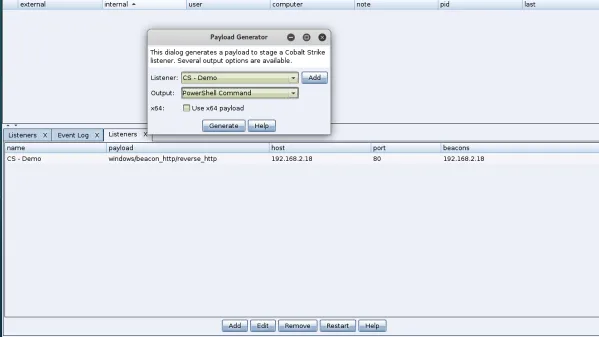
Cobalt Strike 使用混淆绕WindowsDefender
原文：http://www.offensiveops.io/tools/cobalt-strike-bypassing-windows-defender-with-obfuscation/  （2018-03)
翻译：XT.

> 对于这样一篇18年的文章我们发现目前由于攻防软件的升级，目前已经不再适用绕过了，但是其中的一些手法和方式仍然值得学习借鉴，针对新工具下的攻防仍待进一步学习研究。

<!--more-->

### 0x01 前言
对所有红队来说想要提交个payloads并不触发任何告警一直是一个挑战。就像所有安全检测方案一样，Windows Defender可作为测试如Cobalt Strike生成的payload的一个检测工具。

### 0x02 分析
在这个样本中我们将会使用Cobalt Strike生成一段powershell payload，之后看看我们如何操作他并让它绕过一台Windows10 PC的Windows Defender。这或许并不是最优雅或者最简单的方法在Windows Defender防护下隐藏你的payloads，但是这是我们使用过的有效的方法之一。

创建payload的过程如下：

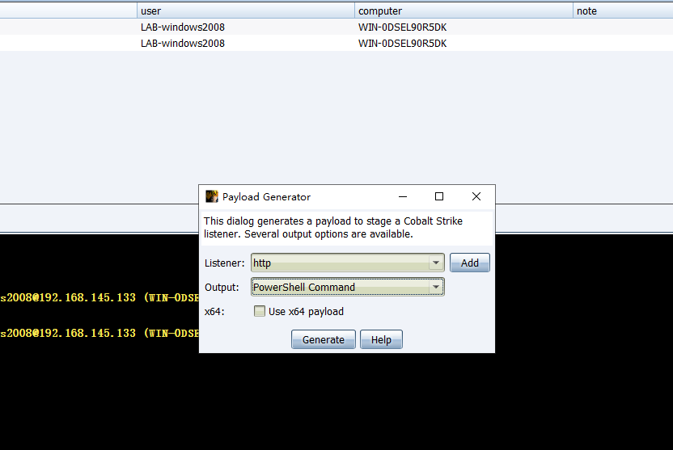
> 经测试发现这里分析不包括x64情况，因为x64生成的代码后面会生成

这会生成包含有PowerShell指令的一个文件payload.txt


如果我们尝试在受害者PC执行命令，我们将会被Windows Defender捕获威胁行为。
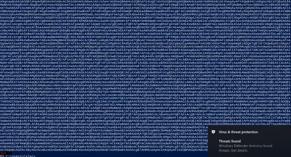

为了绕过Windows Defender我们需要了解下，Cobalt Strike是如何创建payloads的，并且希望当修改一些特征让Windows Defender判定payloads为安全。

第一步当然payload指令base64位编码，通过查找格式转化或者通过Powershell指令追加```-encodedcommand```标定。

为了解码并且观察创建payload暂时先跳过这段

```
powershell.exe -nop -w hidden -encodedcommand
```

使这段先不看。


然后使用下面的代码反编码剩下的字符：
> 这里测试环境失败了我换了个方式

```bash
echo 'base64 payload' | base64 -d
```
这里用了powershell base64解码方式：
```
function Dncoded-Base64String([string]$string){
$byteArray = [Convert]::FromBase64String($string)    
[System.Text.UnicodeEncoding]::Unicode.GetString($byteArray)} 
$wishWords = 'base64 payload here'
$wishWords = Dncoded-Base64String $wishWords
$wishWords.Substring(0)
```

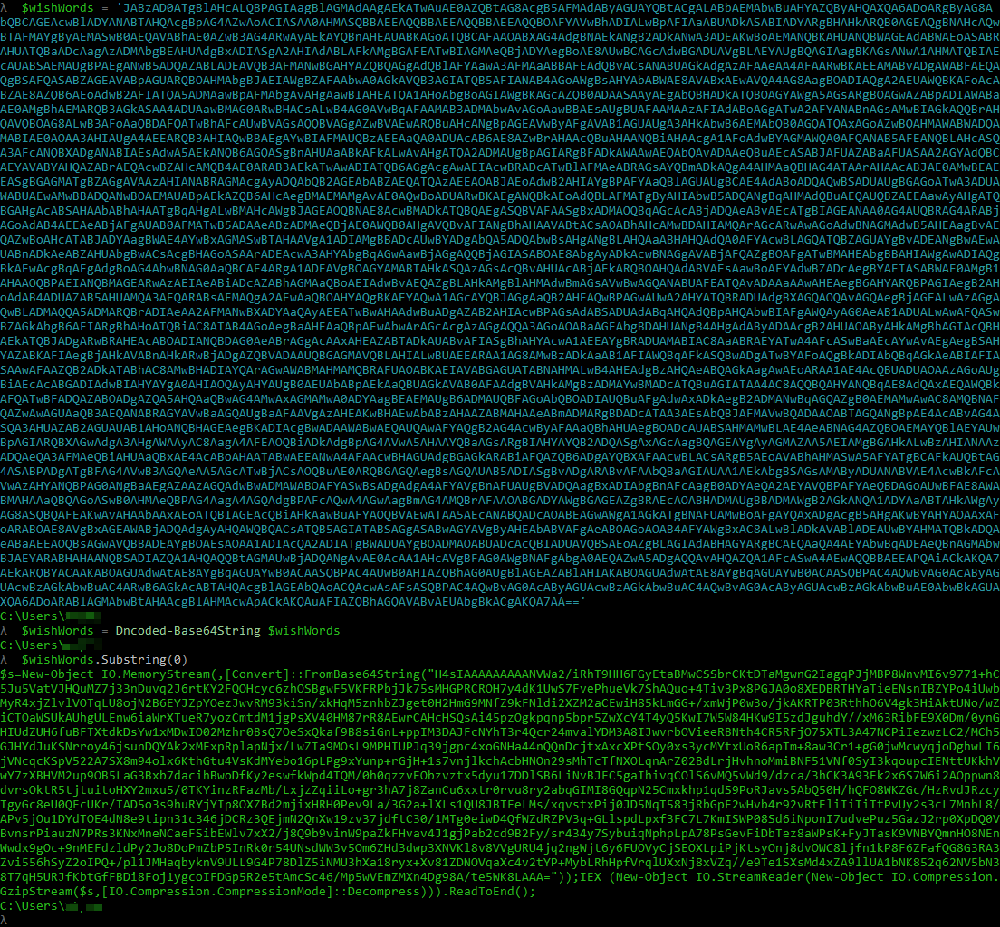

合成解码字符包括又一个base64编码的字符，但是尝试解码失败并出现乱码，由于这段字符被下面的Powershell代码Gzip压缩过的：``` IEX (New-Object IO.StreamReader(New-Object IO.Compression.GzipStream($s[IO.Compression.CompressionMode]::Decompress))).ReadToEnd()```

> 笔者一次base64之后结果如下：
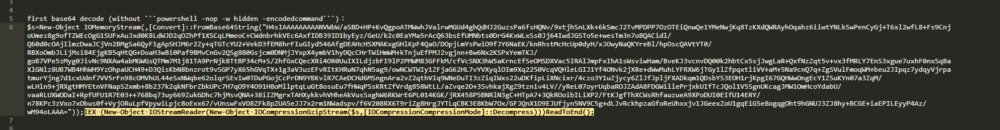

现在我们需要知道里面的命令那一部分payload实际触发了Windows Defender。通过一些谷歌搜索发现这段PowerShell脚本工具可用于解码，如这个链接内容介绍：http://chernodv.blogspot.com.cy/2014/12/powershell-compression-decompression.html

```
$data = [System.Convert]::FromBase64String('gzip base64')
$ms = New-Object System.IO.MemoryStream
$ms.Write($data, 0, $data.Length)
$ms.Seek(0,0) | Out-Null
$sr = New-Object System.IO.StreamReader(New-Object System.IO.Compression.GZipStream($ms, [System.IO.Compression.CompressionMode]::Decompress))
$sr.ReadToEnd() | set-clipboard
```
> 笔者Gzip解码后结果如下：
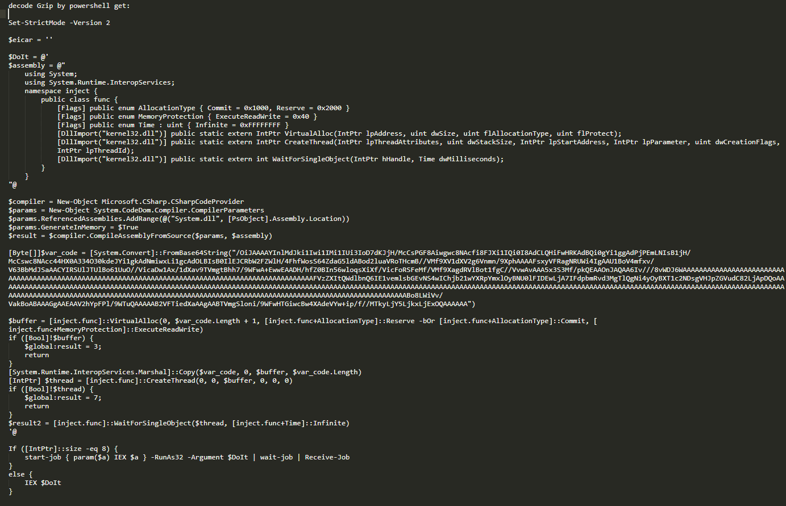

这个脚本会第一步执行base64解码字符并且解压缩最后得到整段代码。最后复制结果到剪切板，执行成功只需要粘贴即可保存。


$var_code值即存放着被WindowsDefender检测的payload，我们需要替换并绕过检测防护。

进一步解码$var_code发现其是由一些ASCII字符构成，但是这里并不需要完全解码它：

```
$enc=[System.Convert]::FromBase64String('encoded string')
```

我们可以通过下面的代码阅读其中的内容：
```
$readString=[System.Text.Encoding]::ASCII.GetString($enc)
```
> 笔者payload解码:
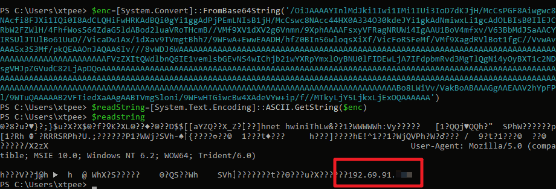

在上面的信息中可以看到UA及攻击者IP。


### 0x03 加混淆
目标使用当前的payload并混淆的方式会触发Windows Defender。最好的工具并且可选择Invoke-Obfuscation种类的一个工具是Daniel Bohannon(https://twitter.com/danielhbohannon?lang=en)，其git地址为：https://github.com/danielbohannon/Invoke-Obfuscation 。

启动Invoke-Obfuscation的方式如下：
```
Import-Module .\Invoke-Obfuscation.psd1
Invoke-Obfuscation
```
现在我们需要定义我们需要混淆的payload部分。可以使用下面的指令，再进行一次混淆操作：

```
Set scriptblock 'final_base64payload'
```
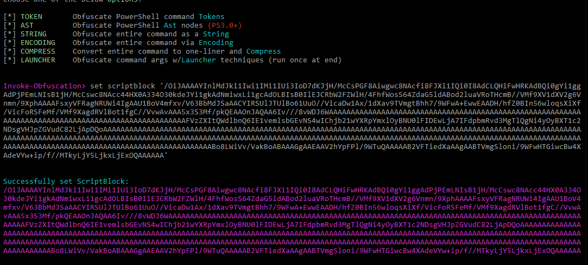

> 插一句，这里执行的时候其实是触发了火绒，但是Windows Defender并未触发，火绒放行即可：
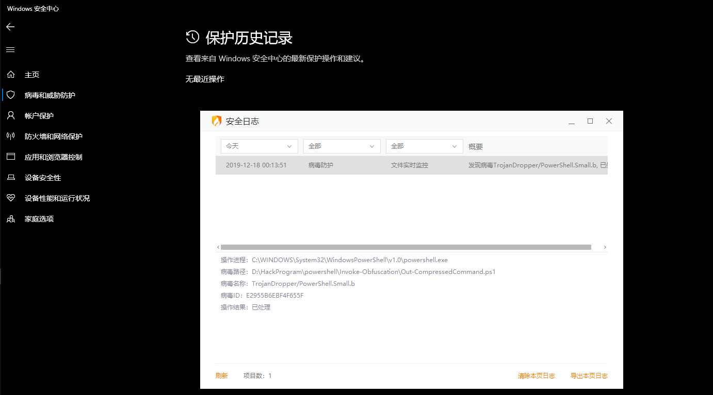

该工具会获取我们的脚本然后询问我们想要执行混淆的方式。在这里我选择了COMPRESS，选择1。这并不意味着其他参数不起作用，只是作者编写时发现这个有效。Invoke-Obfuscation处理并输出充分混淆后的PowerShell命令，将潜在的可以绕过Windows Defender。
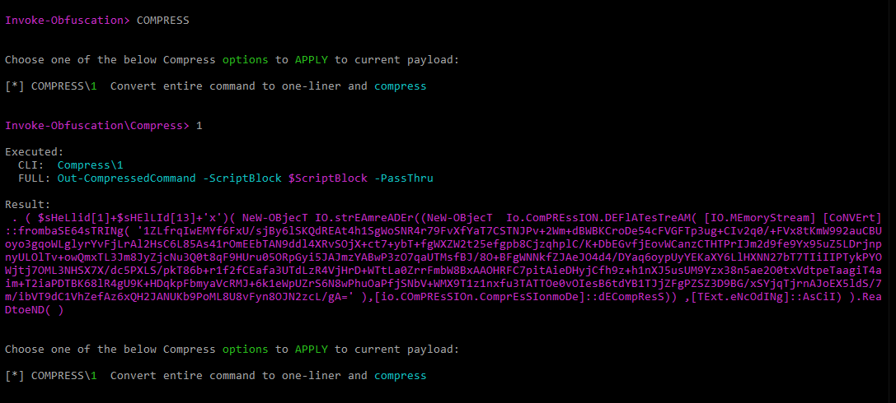

之后打印输出保存

```
Out c:\payload.ps1
```
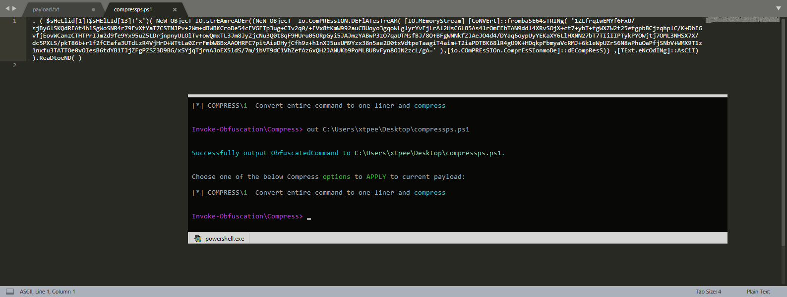

替换掉原来的被解压的payload如下所示看起来这样：
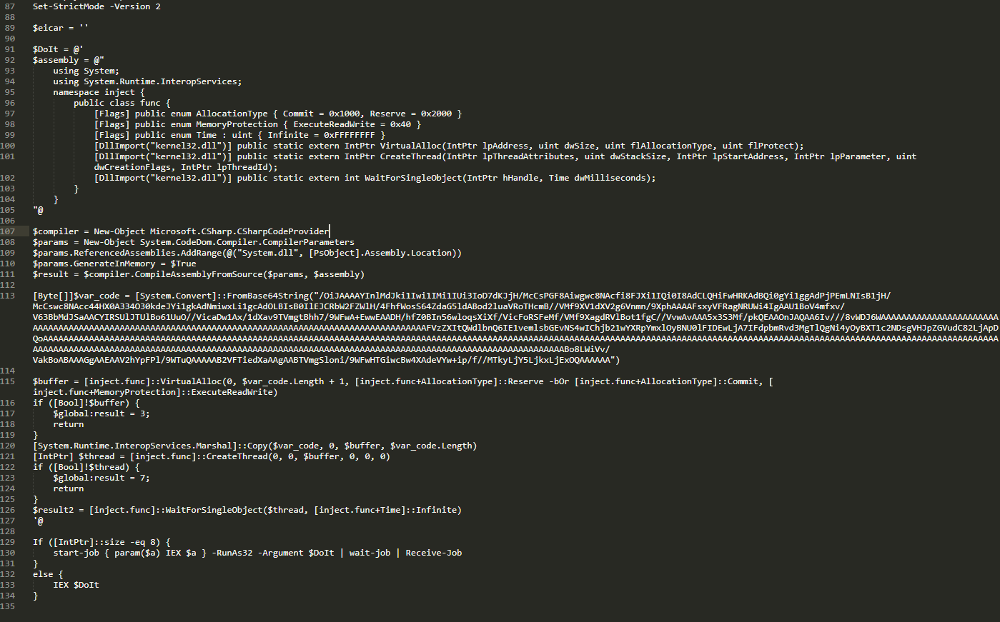

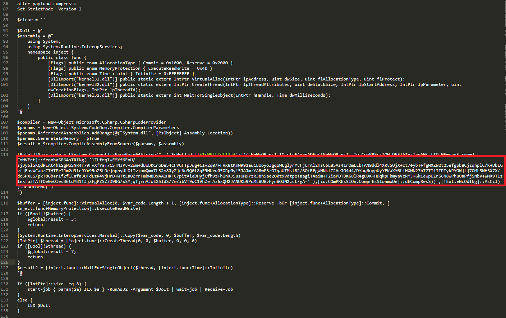

因此最后我们需要通过Invoke-Obfuscation创建新的``` [Byte[]]$var_code = [System.Convert]::FromBase64String ```的内容替换原payload。 为了完成这一步，这里定义了一个新的变量命名$evil然后把由Invoke-Obfuscation混淆后的内容放在其中。
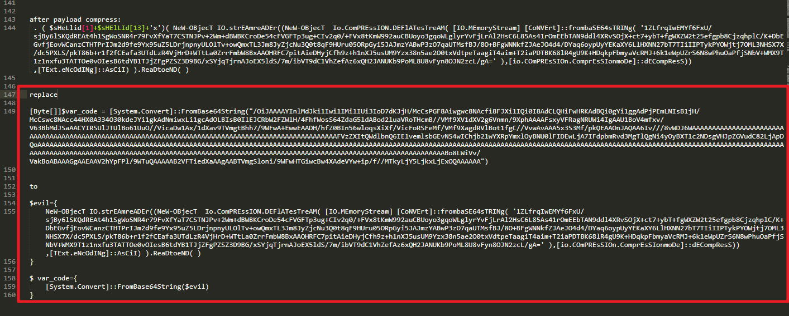

重点：你需要从invoke-Obfuscation输出的内容中剔除 ```|```，因为它是命令执行的指令。我们不需要它因为Cobalt Strike模板会处理这个。

> 原文的图片实在是太模糊了，吐

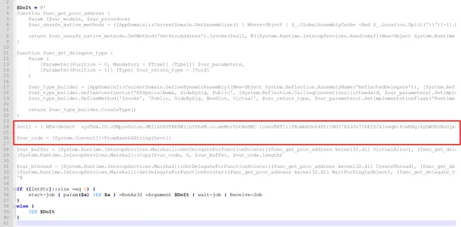

> 本地测试按照提示进行替换，并保存为.ps1文件，放入靶机测试
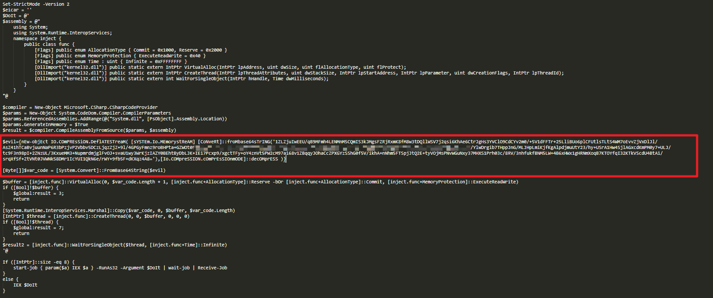
> 经测试，发现目前此方式由于非base64导致报错，导致脚本无法执行成功
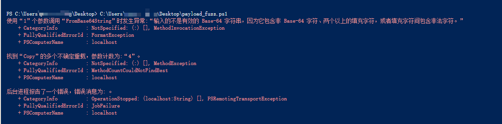


保存编辑的脚本到powershell文件并执行。当Cobalt Strike中的beacon点亮，并出现提示@sec_groundzero Aggressor 脚本的注意之后成功。

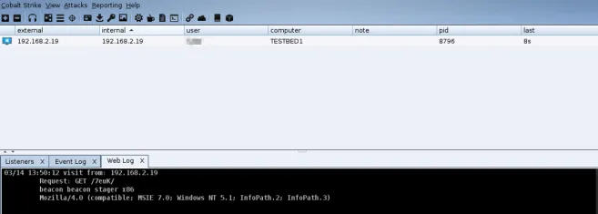


如果我们同时检查原始 CS payload和修改过的 CS payload，通过Process Hacker我们看到我们并不会改变beacon的行为。

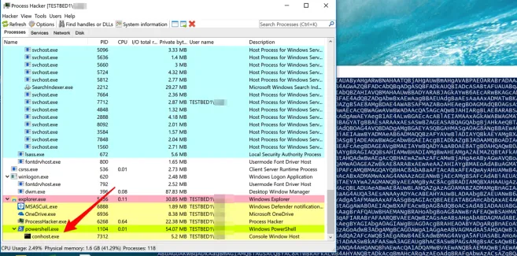

> 在最后，整体实践结果发现，文中提到的cs powershell 混淆的思路是先解base64再解gzip压缩，然后针对payload有效部分进行专用工具混淆。而目前出现的问题是，payload只能混淆x86的，而测试x64payload使用此文的混淆会出现混淆报错。另外x86混淆之后再通过添加新变量引入混淆后的字符过程目前测试会导致报错，因此实验未能达到预期目的，这部分内容会在后续跟进。
