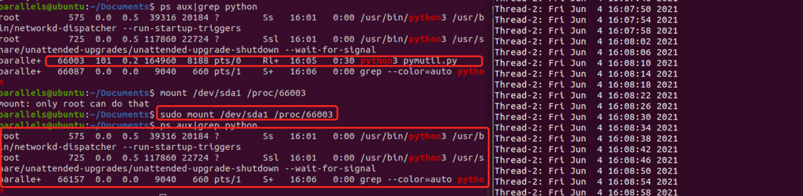
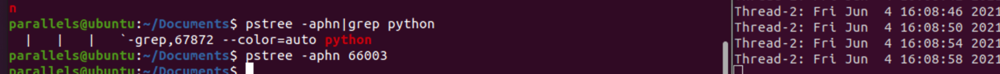
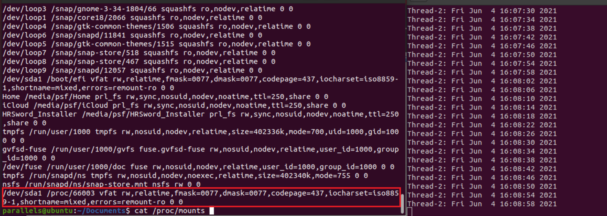

> 分子实验室 https://molecule-labs.com/

最近在精细应急响应相关内容的时候注意到linux进程隐藏确实会是应急响应中的一个问题，因此这里对目录挂载方式的隐藏进程方式进行了实践和查询的对抗了解。

### 创建挂载隐藏进程

```
方式1
mount /dev/sda1 /proc/xxx


方式2
mount -o bind /empty/dir /porc/xxxx
```





###  查询隐藏挂载目录方式进程的办法

linux /proc/66003 文件系统内容通过挂载操作已经为空，无法获取细节


唯一查看到隐藏进程的办法是通过cat /proc/mounts 查看挂载项中包含/proc/pid



