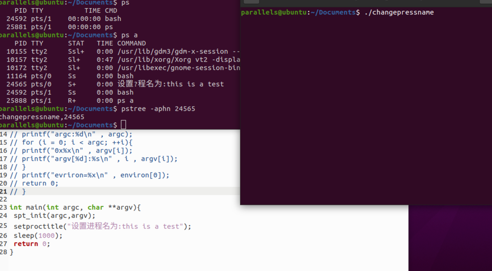
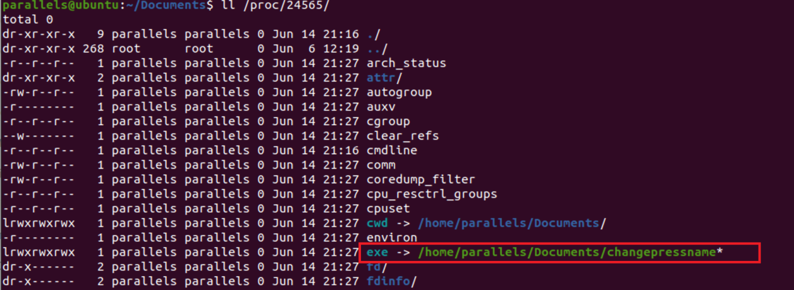
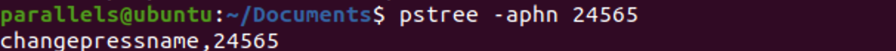

> 分子实验室 https://molecule-labs.com/

### 背景：

在测试系统命令对linux隐藏进程的有效性测试，记录的相关知识点。

### 原理：

在恶意代码中通过设置具有迷惑性的进程名字，以达到躲避管理员检查的目的


### 测试环境：

ubuntu

### 过程：

这里我们参考：linux 修改进程名称的方法伪造进程 https://www.jb51.net/article/70306.htm，排坑时注意添加声明即可。

```
#include <stdio.h>
#include <string.h>
#include "./util/setproctitle.c"
# --这里需要注意规避报错--
# 原版这里我测试的时候报错，需要加上下面的函数引用
#ifdef _WIN32
#include <Windows.h>
#else
#include <unistd.h>
#endif
# --引用完毕--
// extern char **environ;
// int main(int argc , char *argv[])
// {
// int i;
// printf("argc:%d\n" , argc);
// for (i = 0; i < argc; ++i){
// printf("0x%x\n" , argv[i]);
// printf("argv[%d]:%s\n" , i , argv[i]);
// }
// printf("evriron=%x\n" , environ[0]);
// return 0;
// }
int main(int argc, char **argv){
 spt_init(argc,argv);
 setproctitle("设置进程名为:this is a test");
 sleep(1000);
 return 0;
}
```


setproctitle.c（这个不变）文件如下：

```
/* ==========================================================================
 * setproctitle.c - Linux/Darwin setproctitle.
 * --------------------------------------------------------------------------
 * Copyright (C) 2010 William Ahern
 * Copyright (C) 2013 Salvatore Sanfilippo
 * Copyright (C) 2013 Stam He
 *
 * Permission is hereby granted, free of charge, to any person obtaining a
 * copy of this software and associated documentation files (the
 * "Software"), to deal in the Software without restriction, including
 * without limitation the rights to use, copy, modify, merge, publish,
 * distribute, sublicense, and/or sell copies of the Software, and to permit
 * persons to whom the Software is furnished to do so, subject to the
 * following conditions:
 *
 * The above copyright notice and this permission notice shall be included
 * in all copies or substantial portions of the Software.
 *
 * THE SOFTWARE IS PROVIDED "AS IS", WITHOUT WARRANTY OF ANY KIND, EXPRESS
 * OR IMPLIED, INCLUDING BUT NOT LIMITED TO THE WARRANTIES OF
 * MERCHANTABILITY, FITNESS FOR A PARTICULAR PURPOSE AND NONINFRINGEMENT. IN
 * NO EVENT SHALL THE AUTHORS OR COPYRIGHT HOLDERS BE LIABLE FOR ANY CLAIM,
 * DAMAGES OR OTHER LIABILITY, WHETHER IN AN ACTION OF CONTRACT, TORT OR
 * OTHERWISE, ARISING FROM, OUT OF OR IN CONNECTION WITH THE SOFTWARE OR THE
 * USE OR OTHER DEALINGS IN THE SOFTWARE.
 * ==========================================================================
 */
#ifndef _GNU_SOURCE
#define _GNU_SOURCE
#endif
 
#include <stddef.h>  /* NULL size_t */
#include <stdarg.h>  /* va_list va_start va_end */
#include <stdlib.h>  /* malloc(3) setenv(3) clearenv(3) setproctitle(3) getprogname(3) */
#include <stdio.h>  /* vsnprintf(3) snprintf(3) */
#include <string.h>  /* strlen(3) strchr(3) strdup(3) memset(3) memcpy(3) */
#include <errno.h>  /* errno program_invocation_name program_invocation_short_name */
#if !defined(HAVE_SETPROCTITLE)
#define HAVE_SETPROCTITLE (defined __NetBSD__ || defined __FreeBSD__ || defined __OpenBSD__)
#endif
#if !HAVE_SETPROCTITLE
#if (defined __linux || defined __APPLE__)
extern char **environ;
static struct {
  /* original value */
  const char *arg0;
  /* title space available */
  char *base, *end;
   /* pointer to original nul character within base */
  char *nul;
  _Bool reset;
  int error;
} SPT;
#ifndef SPT_MIN
#define SPT_MIN(a, b) (((a) < (b))? (a) : (b))
#endif
static inline size_t spt_min(size_t a, size_t b);
static int spt_clearenv(void);
static int spt_copyenv(char *oldenv[]);
static int spt_copyargs(int argc, char *argv[]) ;
void spt_init(int argc, char *argv[]);
void setproctitle(const char *fmt, ...);
static inline size_t spt_min(size_t a, size_t b) {
  return SPT_MIN(a, b);
} /* spt_min() */
/*
 * For discussion on the portability of the various methods, see
 * http://lists.freebsd.org/pipermail/freebsd-stable/2008-June/043136.html
 */
static int spt_clearenv(void) {
#if __GLIBC__
  clearenv();
  return 0;
#else
  extern char **environ;
  static char **tmp;
  if (!(tmp = malloc(sizeof *tmp)))
    return errno;
  tmp[0] = NULL;
  environ = tmp;
  return 0;
#endif
} /* spt_clearenv() */
static int spt_copyenv(char *oldenv[]) {
  extern char **environ;
  char *eq;
  int i, error;
  if (environ != oldenv)
    return 0;
  if ((error = spt_clearenv()))
    goto error;
  for (i = 0; oldenv[i]; i++) {
    if (!(eq = strchr(oldenv[i], '=')))
      continue;
    *eq = '\0';
    error = (0 != setenv(oldenv[i], eq + 1, 1))? errno : 0;
    *eq = '=';
    if (error)
      goto error;
  }
  return 0;
error:
  environ = oldenv;
  return error;
} /* spt_copyenv() */
static int spt_copyargs(int argc, char *argv[]) {
  char *tmp;
  int i;
  for (i = 1; i < argc || (i >= argc && argv[i]); i++) {
    if (!argv[i])
      continue;
    if (!(tmp = strdup(argv[i])))
      return errno;
    argv[i] = tmp;
  }
  return 0;
} /* spt_copyargs() */
void spt_init(int argc, char *argv[]) {
    char **envp = environ;
  char *base, *end, *nul, *tmp;
  int i, error;
  if (!(base = argv[0]))
    return;
  nul = &base[strlen(base)];
  end = nul + 1;
  for (i = 0; i < argc || (i >= argc && argv[i]); i++) {
    if (!argv[i] || argv[i] < end)
      continue;
    end = argv[i] + strlen(argv[i]) + 1;
  }
  for (i = 0; envp[i]; i++) {
    if (envp[i] < end)
      continue;
    end = envp[i] + strlen(envp[i]) + 1;
  }
  if (!(SPT.arg0 = strdup(argv[0])))
    goto syerr;
  if ((error = spt_copyenv(envp)))
    goto error;
  if ((error = spt_copyargs(argc, argv)))
    goto error;
  SPT.nul = nul;
  SPT.base = base;
  SPT.end = end;
  return;
syerr:
  error = errno;
error:
  SPT.error = error;
} /* spt_init() */
#ifndef SPT_MAXTITLE
#define SPT_MAXTITLE 255
#endif
void setproctitle(const char *fmt, ...) {
  char buf[SPT_MAXTITLE + 1]; /* use buffer in case argv[0] is passed */
  va_list ap;
  char *nul;
  int len, error;
  if (!SPT.base)
    return;
  if (fmt) {
    va_start(ap, fmt);
    len = vsnprintf(buf, sizeof buf, fmt, ap);
    va_end(ap);
  } else {
    len = snprintf(buf, sizeof buf, "%s", SPT.arg0);
  }
  if (len <= 0)
    { error = errno; goto error; }
  if (!SPT.reset) {
    memset(SPT.base, 0, SPT.end - SPT.base);
    SPT.reset = 1;
  } else {
    memset(SPT.base, 0, spt_min(sizeof buf, SPT.end - SPT.base));
  }
  len = spt_min(len, spt_min(sizeof buf, SPT.end - SPT.base) - 1);
  memcpy(SPT.base, buf, len);
  nul = &SPT.base[len];
  if (nul < SPT.nul) {
    *SPT.nul = '.';
  } else if (nul == SPT.nul && &nul[1] < SPT.end) {
    *SPT.nul = ' ';
    *++nul = '\0';
  }
  return;
error:
  SPT.error = error;
} /* setproctitle() */
#endif /* __linux || __APPLE__ */
#endif /* !HAVE_SETPROCTITLE */
```


测试修改进程名shell：

```
parallels@ubuntu:~/Documents$ gcc -o changepressname changepress.c 
parallels@ubuntu:~/Documents$ ./changepressname
```

ps查询可以看到我们已经修改进程名



这里攻击的角度，我们就可以集成，并通过指定我们攻击进程进行隐藏。


### 防守对抗角度

从防守角度，测试一下我们应对方法，

1. 可以看到ll /proc/PID/exe，可以通过对比ps结果名与exe对应进程名审计到异常



2. 另外一个就是pstree查询，可以看到执行的程序名与ps查询结果无法对应也可以审计到异常

parallels@ubuntu:~/Documents$ pstree -aphn 24565 

changepressname,24565 


