#### 计划任务隐藏

这里我们参考AnonySec的文章创建隐藏计划任务https://mp.weixin.qq.com/s/-G9aOm0mBh7eD7S5j9Lvog

创建任务

```
schtasks /create /tn TestSchtask /tr C:\Windows\System32\cmd.exe /sc DAILY /st 13:00:00
```

查询创建任务

```
schtasks /query /TN TestSchtask /V /FO list
```

Id {GUID}，任务对应的guid编号。
Index 一般任务值为3，其他值未知。
SD Security Descriptor 安全描述符，在Windows中，每一个安全对象实体都拥有一个安全描述符，安全描述符包含了被保护对象相关联的安全信息的数据结构，它的作用主要是为了给操作系统提供判断来访对象的权限。

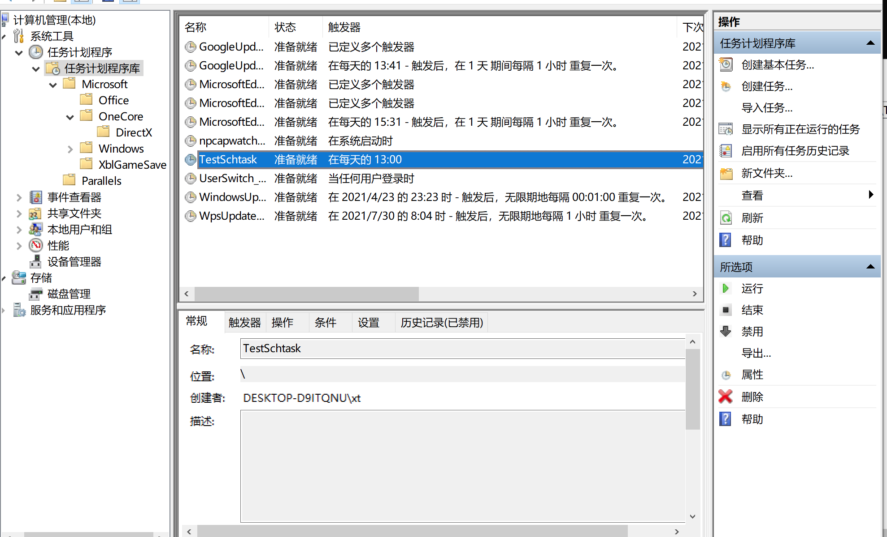


##### 1. 非完全隐藏计划任务方式- index设0

通过修改index值，为0进行隐藏。


HKLM\SOFTWARE\Microsoft\Windows NT\CurrentVersion\Schedule\TaskCache\Tree


这里需要注意rugu 想要修改index值，那么攻击时需要调整权限属性，将注册表的管理者权限改为当前用户，以修改index值。


whoami可知当前用户为desktop-d9itqnu\xt

C:\Users\xt>whoami

desktop-d9itqnu\xt

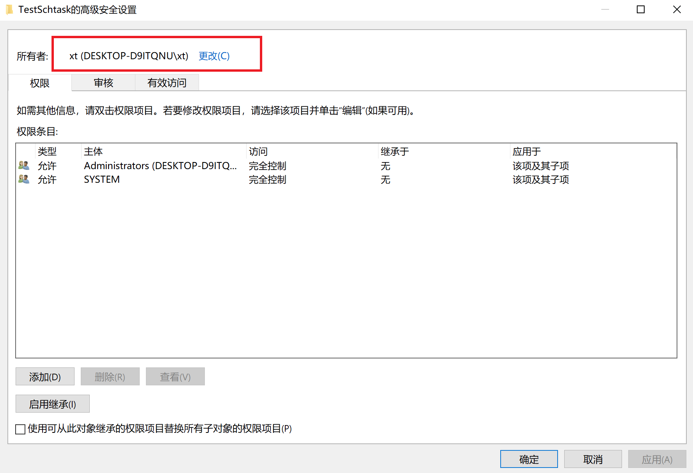

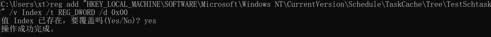


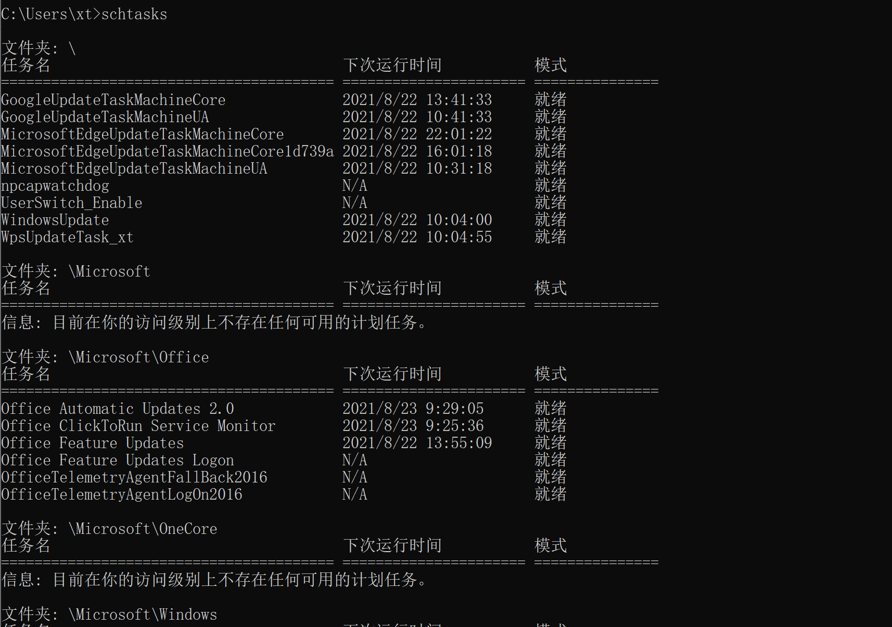

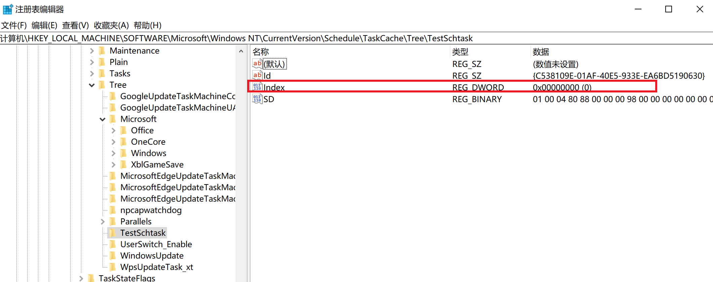

schtasks.exe无法直接查到

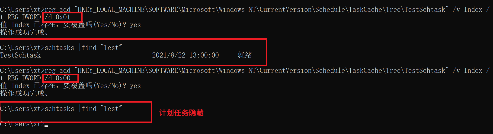

如果知道计划任务名称可以通过指定计划任务名称查询值：

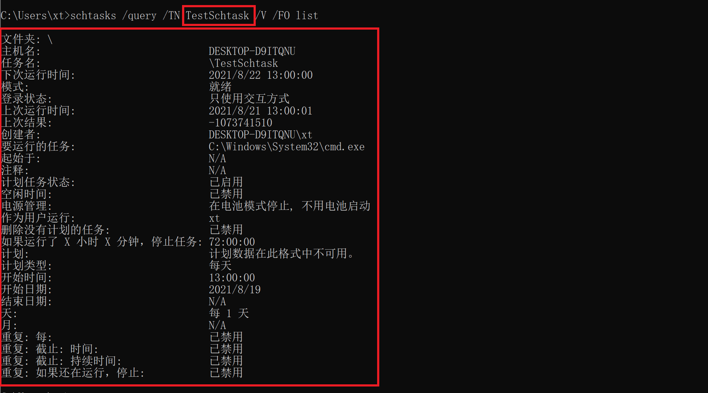

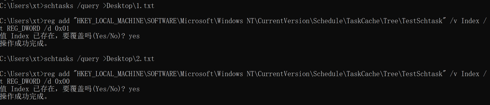

我们将index在改变值的前后schtasks的查询结果分别保存并对比，index=0导出保存为1.txt，将index=1导出保存为2.txt可以看到，**结论一：确实在查询schtasks的时候由于index设置导致无法在schtasks查询到计划任务。**

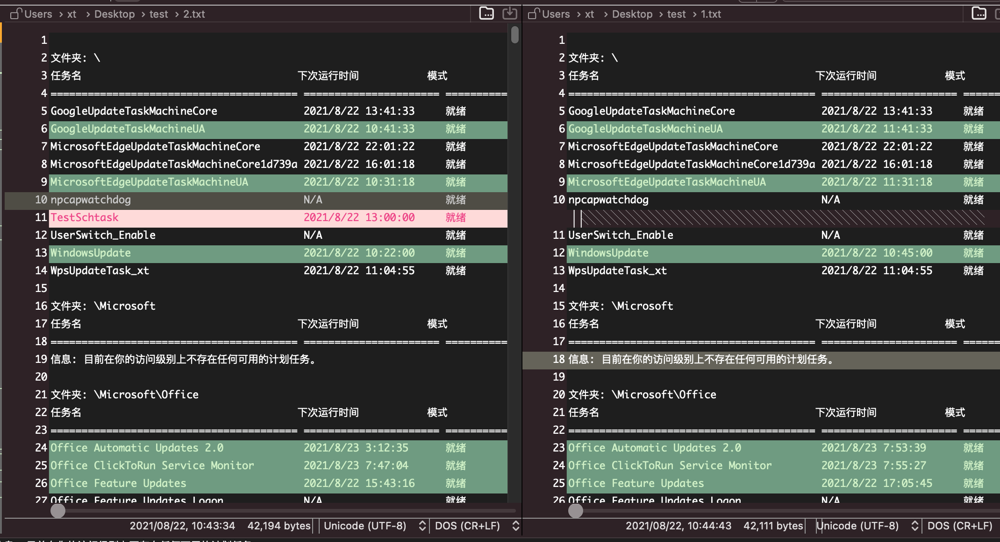

并且在当前用户的计划任务UI中也是无法看到。

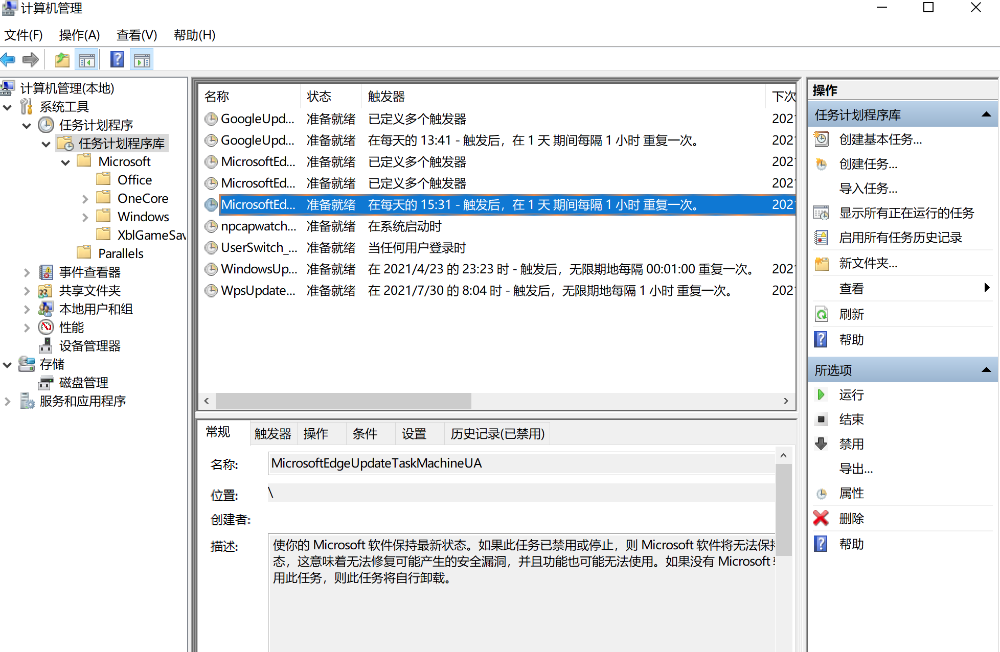

##### 应对方式

这时由于注册表没有改动，并且reg功能正常的情况下，我们是可以通过reg针对计划任务树查询并确定可疑的计划任务。

1. 直接查询注册表HKLM\SOFTWARE\Microsoft\Windows NT\CurrentVersion\Schedule\TaskCache\Tree中的计划任务树。

```
reg query "HKLM\SOFTWARE\Microsoft\Windows NT\CurrentVersion\Schedule\TaskCache\Tree"  
```

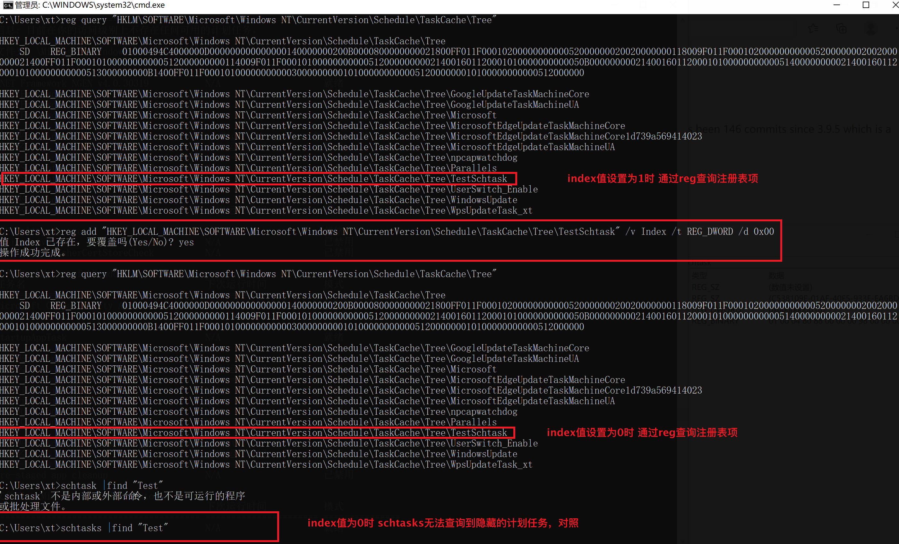


1. 针对可疑的计划任务我们仍然可疑通过schtasks指定计划任务名称查询。指定TestSchtask查询计划任务详情。

这里需要注意，由于index值为0，此时想要通过schtasks发现异常的任务项是无法获取index值为0的项目，此时通过对比注册表查询结果可以快速定位异常的注册表值，再通过schtasks指定任务名称可以强制查询得到对应详情。

```
schtasks /query /TN TestSchtask /V /FO list
```

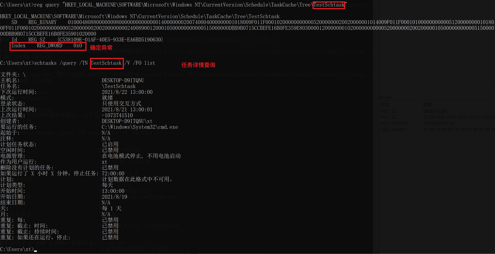


1. 由于在修改index的时候需要注册表归属从原默认的system修改成当前用户，因此这个注册表的归属地方会有修改的痕迹


可以重点检查相关注册表的归属，确认痕迹：

HKLM\SOFTWARE\Microsoft\Windows NT\CurrentVersion\Schedule\TaskCache\Tree


##### 2. 完全隐藏计划任务方式 - SD 删除

删除 HKLM\Software\Microsoft\Windows NT\CurrentVersion\Schedule\TaskCache\Tree\{TaskName}\SD

删除 %SystemRoot%\System32\Tasks 下任务对应的 XML 文件

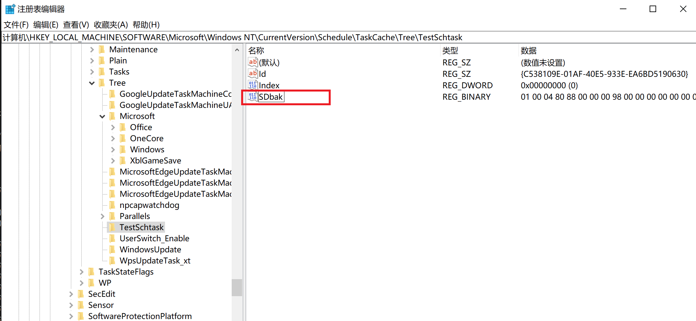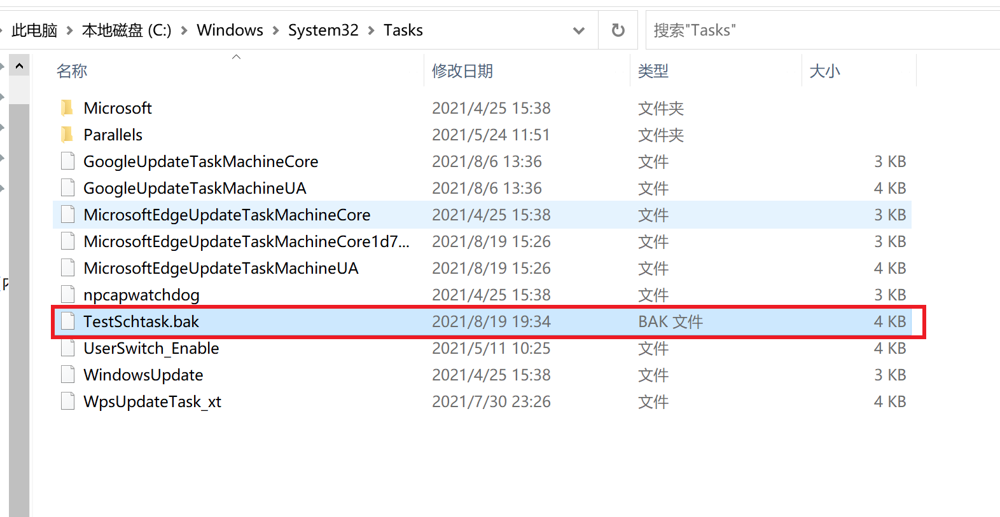


这种情况对我们检查的影响是在schtasks查询的时候无法指定隐藏的计划任务查询详情了，我们仍然可以通过注册表来审计异常项，

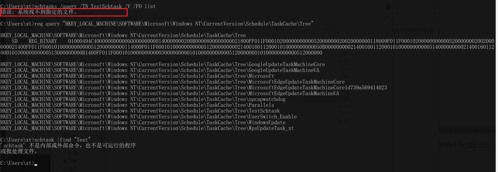
