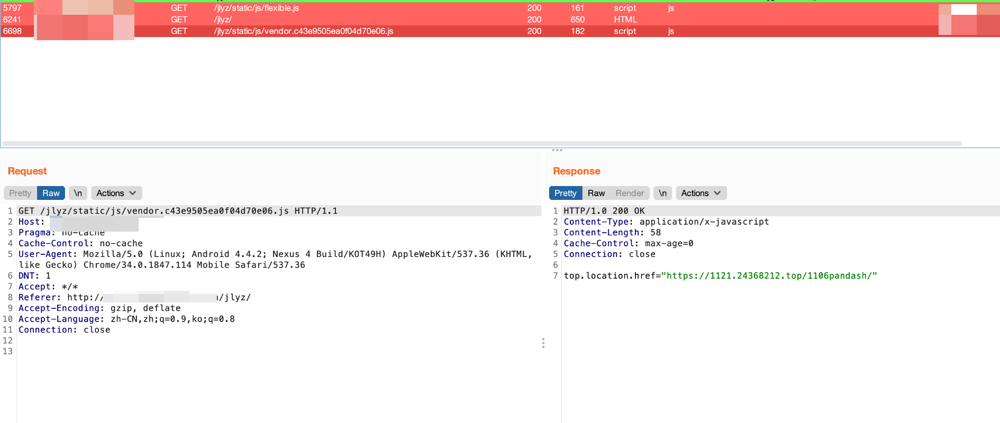
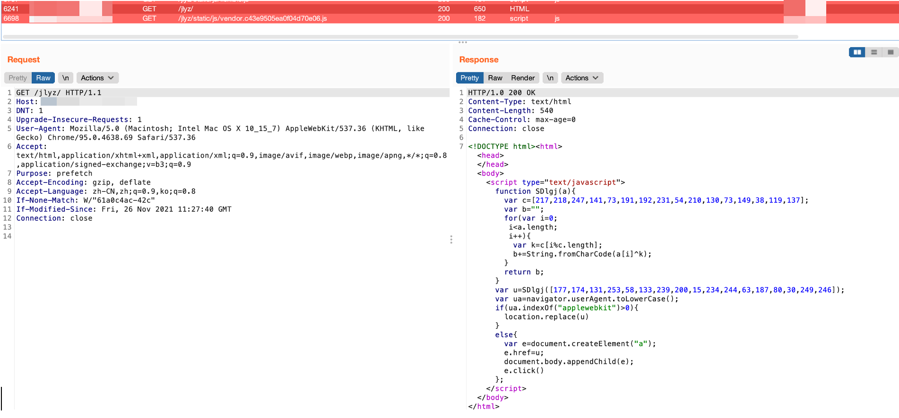
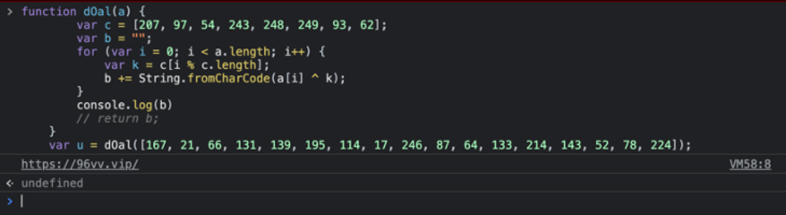
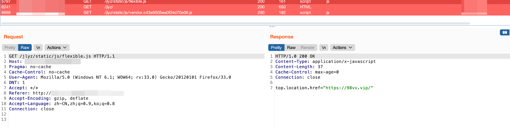
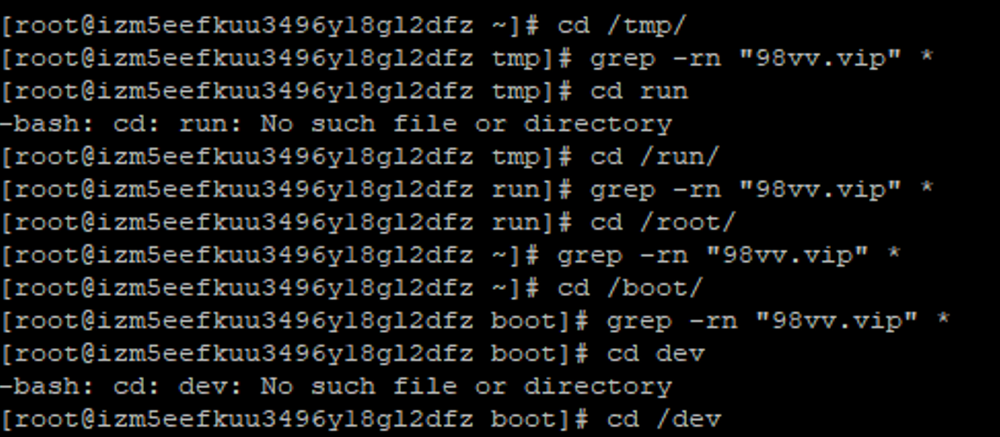
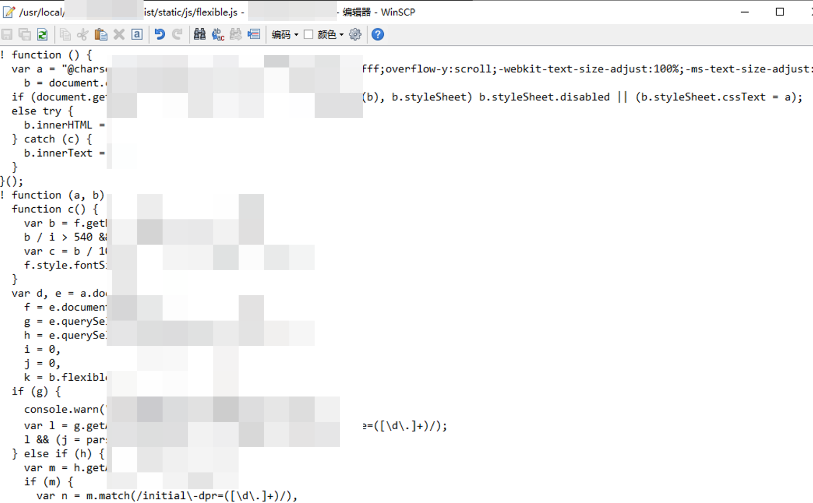
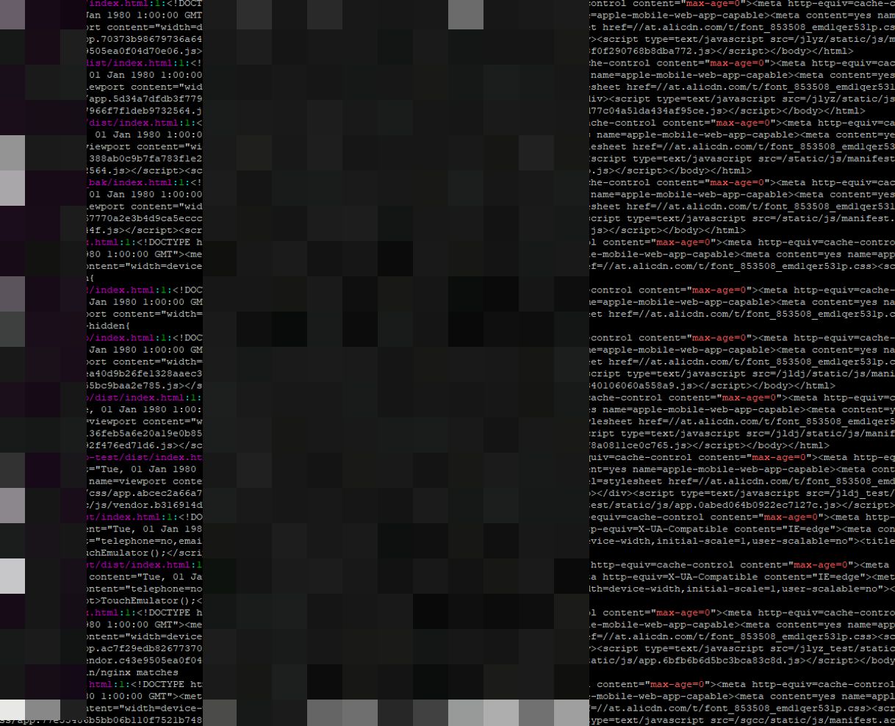
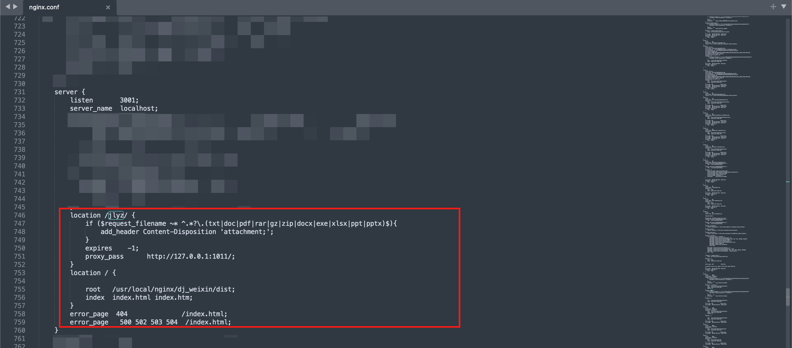

近期的一个应急中我们注意到某客户web应用每隔一段时间移动端UA访问会发生跳转现象, 但是并非传统的篡改情况比较特殊, 这里特殊记录下.

---more---

首先我们复现页面篡改安全事件的现象, 观察页面篡改的实际情况:
访问某页面, http://xxx/xx 偶尔会跳转到 https[://]1121[.]24368212[.]top/1106/pandash https[://]98vv[.]vip/ , 经确认访问后的特点除了以下几个返回内容之外, 同时header存在max-age=0, 触发方式不固定, 而将UA修改为移动端或切换移动端UA访问会有一定几率触发跳转. 

跳转情况1:

使用top.location.href="xxx", 在样式顶层进行跳转, 可以在iframe外进行跳转. 

跳转情况2:

通过分析可以看到跳转的连接为 https[://]98vv[.]vip/

跳转情况3:

也是使用了top.location.href="xxx", 使用的不同的地址跳转.

由于每次跳转触发不固定, 因此复现的时候也花了一会时间, 这里看到返回包的js我们可以知道确实是通常相关黑灰产使用的js跳转方式. 可以注意到这里使用了top.location.href的方式, 这种方式可以在iframe之外进行跳转.

通常的页面篡改, 到这里我们看到的现象是访问不论是页面还是js都会发生跳转, 首要目的我们会思考是否页面中被插入的js导致返回的内容受控跳转. 这里我们针对三种情况的关键词都在系统中进行全文查找内容, 结果并没有发现相关内容.

接着我们查看相关的页面和js内容, 结果都没有发现可疑的脚本. 

这里只在文件内容中发现了一些max-age=0的页面.

我们查看下中间件的配置, 发现中间件配置也没有发现问题

到此为止我们发现与传统的跳转方式都不同, 与中间件控制的跳转方式也不同. 因此这里考虑到是否存在劫持. 首先dns劫持, 经过排查发现不论是多地多运营商解析域名、还是通过dnslookup都没有看到域名解析异常情况, 由于客户的域名是阿里的域名, 使用修改本地的dns为223.5.5.5以及223.6.6.6再访问还是有问题. 但ip在以上情形下都无变化, 因此判断不是dns劫持情况. 

最后我们排出了系统异常登录、ssh密钥登录等情况判断可能是流量劫持问题. 与阿里同事的客服的判断相同.

最后我们给出了我们的最终的排查或解决方案,
1. 建议https防止运营商拆包加内容

2. 建议dns在域名解析上进行检测

3. 建议和运营商反馈情况排查问题

4. max-age=0尝试改max-age=-1

   

第二天客户反馈, 采用https+反馈运营商, 问题解决.

至此整个跳转情况结束.

IOCs:
https[://]1121[.]24368212[.]top/1106/pandash 
https[://]98vv[.]vip/

