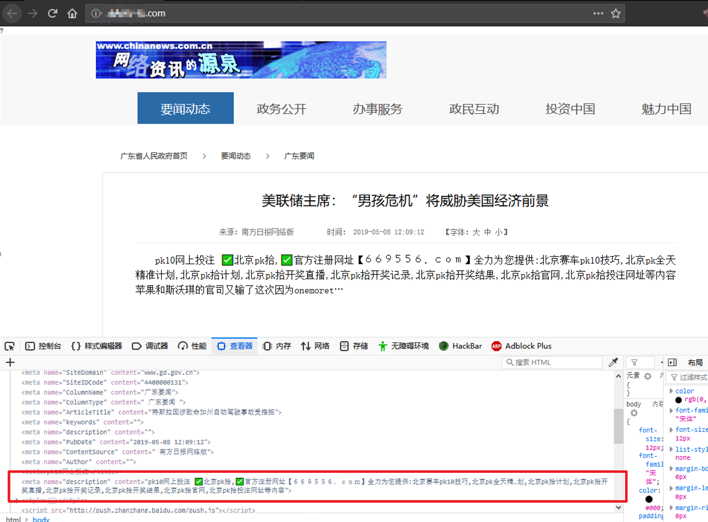
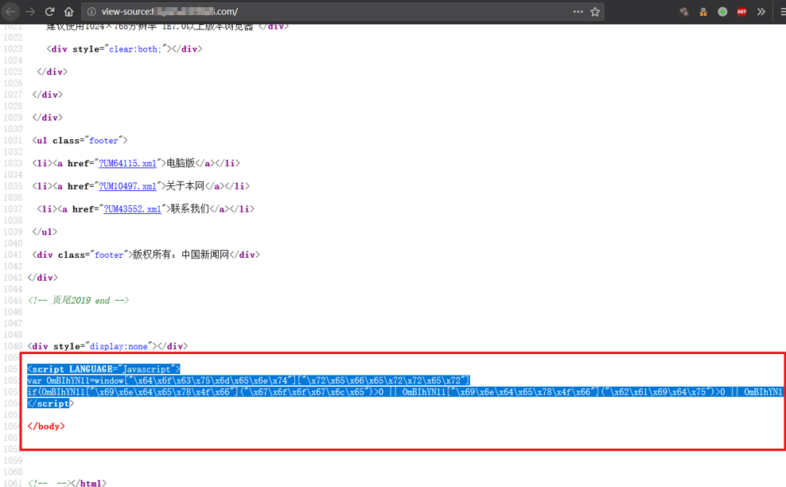
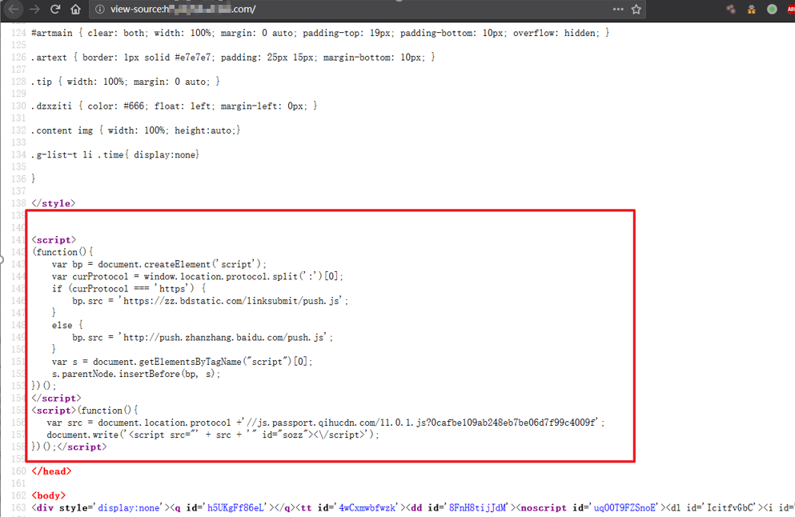

### 某站页面篡改事件取证分析

一处BoCai内容重定向篡改事件的分析及回溯过程。



<!--more-->

#### 0x01 篡改内容调查取证
本次样本来源于工作，该样本使用已经被篡改的模板页面，敏感篡改点（或BoCai触发点）有2处，如图所示
文本篡改如前文图片所示。
主要篡改点如下：



#### 0x02 篡改代码分析
对其编码转码：(转码可直接到sojson.com的 [js解码](https://www.sojson.com/jsjiemi.html))
```javascript
<script LANGUAGE="Javascript">
var OmBIhYNl1=window["document"]["referrer"]
if(OmBIhYNl1["indexOf"]("google")>0 || OmBIhYNl1["indexOf"]("baidu")>0 || OmBIhYNl1["indexOf"]("sogou")>0 ) location["href"]="http://www.a5qqq[.]com";
</script>
```
可以看出该页面除了页面篡改还存在针对来自google、sogou、baidu的请求重定向脚本，脚本重定向到http[://www].a5qqq.com （198.16.46.26）

此外页面还存在有可能有助于定位的，页面统计代码：

http://js.passport.qihucdn.com/11.0.1.js?0cafbe109ab248eb7be06d7f99c4009f  奇虎75cdn统计


#### IOCs

www[.]a5qqq[.]com
vip.haxhr.com
