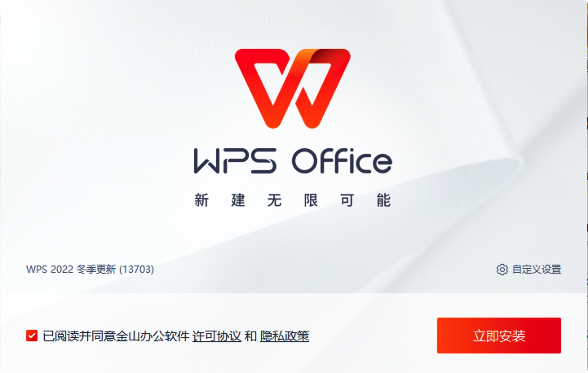
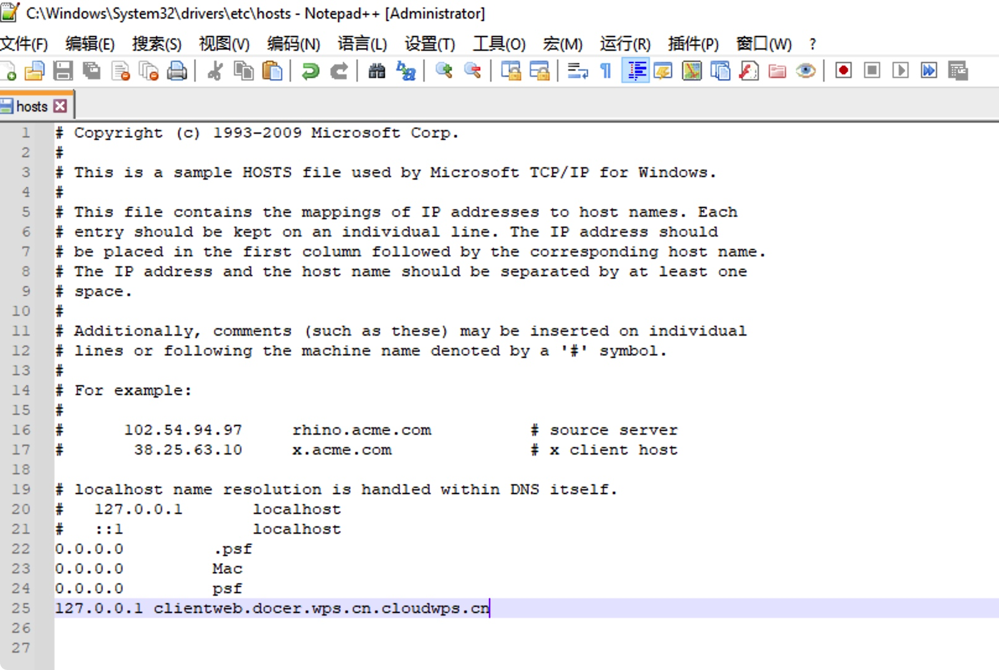
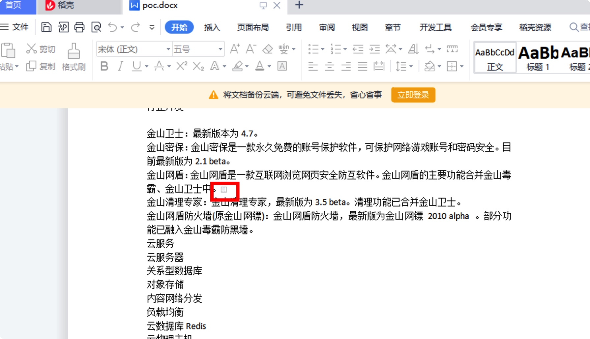
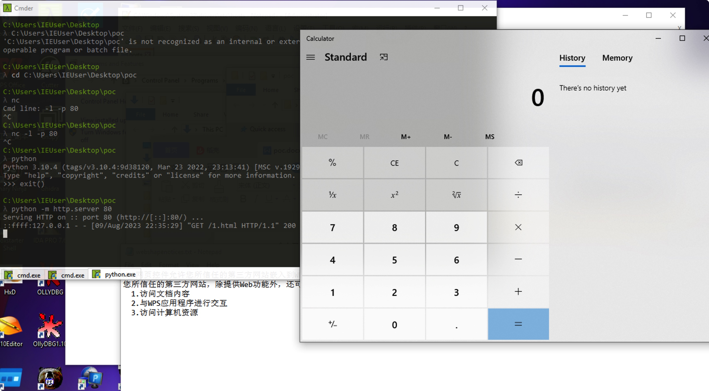
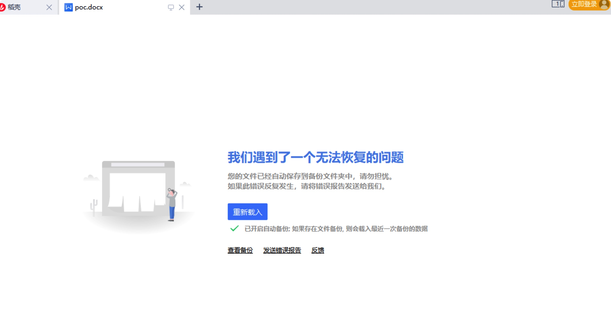
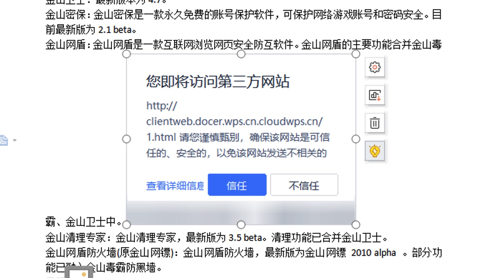
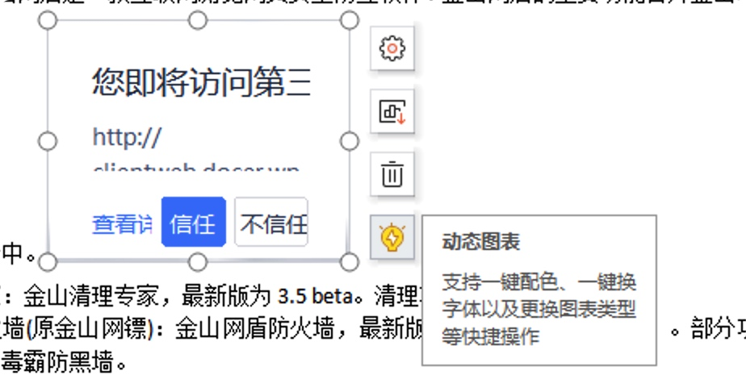
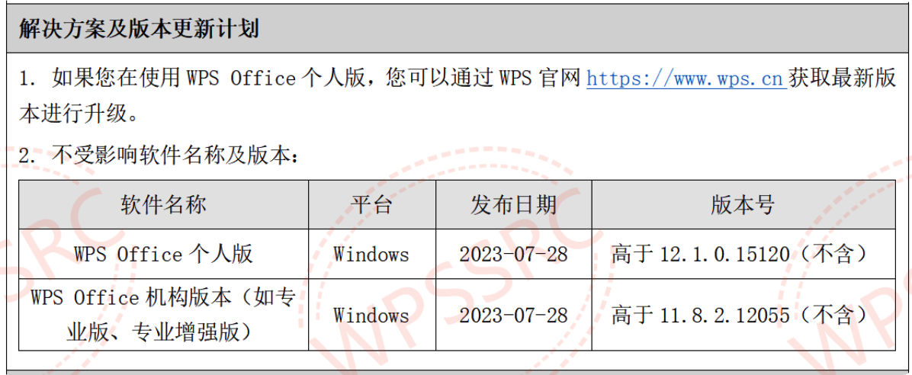

## 摘要
WPS Office 软件是由金山办公软件股份有限公司自主研发的一款办公软件套装，可以实现办公软件最常用的文字、表格、演示等多种功能，覆盖 Windows、 macos、 Linux、 Android、 IOS及鸿蒙等平台。目前该漏洞已修复，请升级至最新版本。 


## 准备
准备个低版本wps，13703
win10



## 环境
原poc的说明：
需要将在1.html当前路径下启动http server并监听80端口，修改hosts文件（测试写死的）
127.0.0.1 clientweb.docer.wps.cn.cloudwps.cn

漏洞触发需让域名规则满足clientweb.docer.wps.cn.{xxxxx}wps.cn即可，cloudwps.cn和wps.cn没有任何关系。正常攻击，也可以使用clientweb.docer.wps.cn.hellowps.cn.


1. 配置host，C:\Windows\System32\drivers\etc\host，增
    ```
    127.0.0.1 clientweb.docer.wps.cn.cloudwps.cn
    
    漏洞触发需让域名规则满足clientweb.docer.wps.cn.{xxxxx}wps.cn即可，cloudwps.cn和wps.cn没有任何关系。正常攻击，也可以使用clientweb.docer.wps.cn.hellowps.cn.
    ```
    


2. 配置监听
注意：要在1.html目录下进行监听 
```
cd C:\Users\IEUser\Desktop\poc
python -m http.server 80
```

3. 点击触发漏洞。


4. 由于加载了恶意shellcode html因此命令执行成功。



影响：
随后程序崩溃



分析：



我们可以看到这是在wps中插入了动态图表，而图表可以对应的链接被我们篡改了解析地址，造成了问题。

这里有个现象，如果把这个图表放到最小那么点击的时候他是不用经过信任不信任选项，就默认会跳转的。所以poc是把这个缩小到最小，就是为了方便点击之后不用点击信任按钮，造成直接跳转。

在这里我们可以看到实际上在原有功能上如果可以加载指定内容的类似超链接、图片等内容的，由于修改了host实际上相当于更换了服务器，也就自然可以换成攻击者的服务器，对应的html执行的命令也就可以不局限于弹计算器。


WPS Office 远程代码执行漏洞消息及Poc，经漏洞云复核，确认为chromium 历史漏洞（编号：CVE-2022-1364，标题：Google Chrome V8类型混淆漏洞)的适配，影响【WPS Office 个人版<11.1.0.15120，WPS office 企业版<11.8.2.12085 】，最新版本WPS Office 不受此漏洞影响

https://github.com/b2git/WPS-0DAY-20230809


## 修复建议

1. 如果您在使用 WPS Office 个人版，您可以通过WPS 官网 https://www.wps.cn 获取最新版本进行升级。

2. 不受影响软件名称及版本：

   wps个人版大于12.1.0.15120，wps机构版/专业版/专业增强版大雨11.8.2.12055。



## 参考资料

[金山办公安全应急响应中心 (wps.cn)](https://security.wps.cn/notices/35)


