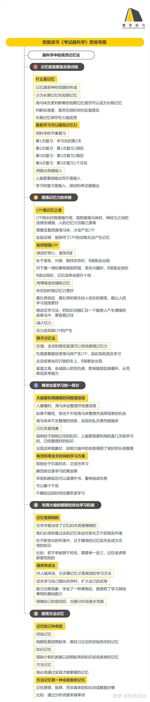

# 《考试脑科学》池谷裕二

## 第一章 记忆究竟是什么

### 能力只能用考试检测吗？

- 记忆的形成，意味着在人脑中留下了“痕迹”。

### 神经元创造出的脑

- 脑科学：记忆是将神经回路的动力学现象转化为一定规则，在突出重叠的空间中，根据读取的外部时空信息，形成一种内部信息表达的过程。

### 记住与忘记

- 短期记忆
- 长期记忆

### 认识海马体

- 只有被海马体判定为必要的信息，才会将短期记忆转为长期记忆。

	- 例如危险环境

### 加油吧，海马体

- 欺骗海马体达到长期记忆

## 第二章 欺骗大脑的方法

### 无论是谁都会忘记

- 忘记不会因人而异。

### 好方法？坏方法？

- 遵循人脑规则的好方法

	- 遵循遗忘曲线进行复习

- 不遵守人脑规则的坏方法

	- 不按照遗忘曲线进行复习
	- 导致记忆混乱或加速遗忘

### 反复记忆的效果

- 反复学习可以降低忘记知识的速度

### 蛮干终究是徒劳

- 海马体欺骗指南

	- 一个月内进行多次复习对于知识转化长期记忆更有力
	- 首次复习输送进海马体的信息越多，成功欺骗海马体的可能性越大
	- 海马体复习计划

		- 第一次复习：学习后的第二天
		- 第二次复习：第一次复习一周后
		- 第三次复习：第二次复习2周后
		- 第四次复习：第三次复习一个月之后
		- 整个计划两个月内完成。

	- 每次复习同样的内容才有效，如果超出的内容只会对记忆造成干扰，降低效率。

### 人脑更重视输出

- 人脑更重视输出而不是输入
- 想要留住记忆，就不能忽视输出
- 灵活运用所学知识的学习方法效率更高

## 第三章 海马体和LTP

### 掌握记忆关键的LTP

- Long term potentiation 长时程增强作用
- 没有LTP就无法形成记忆
- LTP是神经元反复受到刺激后才产生的现象
- 简洁的引发LTP现象

	- 莫扎特效应

		- 通过莫扎特的音乐可以短暂提升期间的智商
		- 某种特殊的脑电波出现才能刺激海马体

### 童心是提高成绩的营养素

- 童心提高成绩

	- 好奇心产生θ波，能够刺激海马体
	- 对要记住的内容越抱有兴趣对于刺激海马体越有利

- 乙酰胆碱AHC

	- 乙酰胆碱是产生θ波的根源，具有刺激海马体，保持意识清晰、提高记忆力的作用
	- 感冒药、止泻药、晕车药等都会抑制乙酰胆碱，关键的两个成分为（东莨菪碱scopolamine，苯海拉明diphenhydramine）

### 所谓回忆

- 激发杏仁核的神经元聚集组织也可以引发LTP
- 杏仁核紧邻海马体，负责产生喜悦、悲伤、焦虑等情绪
- 快乐情绪、舒畅情绪都能刺激大脑高度觉醒，提升人的积极性和注意力刺激海马体产生θ波，进而提升记忆力
- 人在情绪高涨的时候会容易记忆

### 感动式学习

- 压力会抑制LTP
- 焦虑/危机感可以激活杏仁核
- 排解不安，写下来
- 挺胸抬头对自己自信

### 狮子学习法

- 饥饿感、来回走动、降低室温，可以刺激海马体，提升记忆力
- 情绪唤醒

	- emotional arousal
	- 电影/小说如果能让人感动，一般都能坚持看到最后
	- 通过小技巧不断调动情绪，达到刺激海马体，提升记忆

## 第四章 不可思议的睡眠

### 睡觉也是学习的一部分

- 记住自己能记住的所有知识，切实掌握自己能理解的全部内容。然后果断睡觉，交给海马体

### 梦能培养学习实力

- 记忆恢复

	- 做梦时记忆得到巩固，逐渐成熟
	- 保持充足的睡眠很重要

### 睡眠和记忆

- 浅睡眠状态θ波最强
- 睡眠可以将知识进行整理。睡觉前把题目过一遍是很重要的学习技巧。
- 午睡半小时也有效果。只要停止向大脑输入信息，给大脑整理信息的时间。即使人处于清醒状态，只是安静的呆着，海马体就会开始整理信息。
- 因此睡眠就要安静停止其他输入
- 恢复精神和注意力

	- 如果视野中出现“加油”“非常棒”等积极向上的鼓励语，即使本人没怎么意识到，也能实际起到鼓舞人心的效果。

### 学习需要持之以恒

- 两种可以有效利用睡眠的方法

	- 分散学习，将学习分散在不同的时间段进行

		- 忘记的慢
		- 集中学习，短时间学完所有内容

			- 忘记的快

- 生物节律

	- 人出现时差时，海马体中的细胞就会死亡，导致记忆下降
	- 昼夜节律、周节律、月节律、年节律。
	- 星期五效应：周五和周六学习效率最高

### 睡前是记忆的黄金期

- 学习方法与学习的时间段有关

	- 睡觉前1-2小时是记忆的黄金时间

### 能有效利用全天时间的学习方案

- 时间安排的要点

	- 1.饭前处于饥饿状态，正适合学习
	- 2.睡觉前也是学习的黄金期
	- 3.早饭或晚饭后处于饱腹状态时，不学习也不要紧。可以读课外书、看电视，或者玩游戏，做一些自己感兴趣的事，可以让我们的生活更加丰富
	- 4.午后如果实在困的不行，睡午觉，不要有顾虑
	- 5. 如果早就决定要睡午觉，那么午睡前的一段时间内抓紧学习

## 第五章 模糊的大脑

### 记忆的本质

- 根据进化论，人脑的本质是从动物脑进化来的，因此本质就是动物脑
- 外在动机

	- 在设置较大的最终目标的同时，还应该设定一些小目标，即比较容易实现的目标，这样才能激励自己持续学习。

### 面对失败，毫不气馁的积极态度最重要

- 对于学习来说：“善于反省”和“保持乐观”同样重要
- 偏好效应

	- 我们不仅要了解自己擅长的科目是什么，还要思考在考试时，这些科目对于考试结果有怎样的意义，并拟定适当的应试策略才对。

### 人脑和计算机的差异

- 人类学习三要素

	- 1. 不畏失败的毅力
	- 2. 解决问题的能力
	- 3. 乐观的性格

- 感到有趣的瞬间

	- 生而为人，我们有义务把人生活出价值。林肯
	- 保持毅力和信心而努力做下去对于不让付出白费更有利。

### 客观评估自己的学习实力

- 最重要的是不要去看远方模糊的目标，而是要做手边最具体的事情。卡莱尔
- 首先要明确自己的弱点，然后逐步克服，遵循循序渐进的学习方法。设立宏大目标，同时设立容易实现的小目标，一步一步踏实做完。
- 行动兴奋

	- 伏隔核，是控制“干劲儿”的部位。
	- 行动兴奋，一旦开始行动，状态就会渐入佳境，注意力也能只中了。
	- 唤醒伏隔核需要一定时间，可以先开始学习10分钟再说

### 记忆原本就是模糊的

- 记忆的本质就是模糊而随意的
- 吃糖果补充葡萄糖有助于将能量转化为大脑使用，让大脑清醒。
- 牛排和猪排是胜利之后才吃的食物。

### 用反省代替后悔吧

- 人类本来就常常忘记或者出错，失败并不可耻，并没必要过度惧怕失败，更重要的是反省。
- 开头和结尾努力

	- 当注意力放在开头或者结尾的时候注意力就会很集中，因此可以利用此特点，让自己再次集中注意力

### 带着长期计划去学习

- 学习要首先从大局出发，掌握整体面貌
- 逐步了解各个细节
- 最后到细枝末节
- 这种才是遵循人脑性质的科学方法。
- BGM

	- 如果bgm可以提升效率可以试试用bgm辅助学习

### 先扩大擅长科目的优势

- 学会了一种事物，也就相当于拥有了学习其他事物的基础能力。这种现象叫做“学习迁移”
- 学的水平越高，迁移的效果就越好。也就是说记忆的东西越多，脑就越灵光。

## 第六章 天才的记忆机制

### 改变记忆的方法

- 记忆的种类

	- 知识记忆

		- 能够轻易回想起来，与自己过去的经验相关的记忆

	- 经验记忆

		- 缺少契机就很难回想起来的知识或信息类记忆

- 学习的过程中要想办法把知识记忆变成经验记忆

### 联想很重要

- 把想要记忆的内容与其他内容关联在一起的方法叫做“关联记忆法”
- 重点在于精致化能关联起各种事物，并且能够让我们更加容易的会想起这些事物。转为经验记忆。
- 谐音记忆法，是一种常用的记忆精致化的方法。也可以转为经验记忆。
- 想象意义含义对于转化经验记忆同样重要。
- 总结：最好与自己的实际经验结合，越接近自己的经验就越接近经验记忆。

### 向别人讲述学到的知识

- 向其他人或特定的对象进行讲述，能够将知识记忆转化为经验记忆。

### 声音、听觉与记忆

- 学习时一定要动笔、出生、反复输出知识来强化记忆

### 理解记忆的种类和年龄的关系

- 方法记忆

	- 通过身体记住的记忆
	- 通过实践才能掌握的记忆

- 方法记忆的特征

	- 1. 不知不觉中形成的记忆。
	- 2. 方法记忆非常牢固，难以忘记。

- 从原始到高等记忆的方向对三个记忆进行排序：方法记忆、知识记忆、经验记忆

### 根据阶段改变学习方法

- 对于不同的人生阶段应采取不同的学习方法最有效（限小学、初中、高中）

### 方法记忆的魔力

- 创造天才的能力的方法都是方法记忆
- 也就是说将经验记忆锻炼成方法记忆之后将会更加牢固记忆

### 会膨胀的记忆方法

- 举一反三的能力，理解知识本身并运用，对于记住知识本身更容易让人记住。

### 为什么要持续努力

- 持续努力才是最重要的学习新的。因为努力和成果是成指数级增长的。

